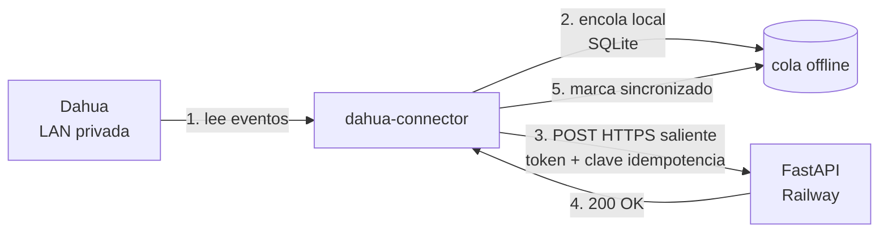

# Requisitos para la integración real con Dahua

**Nada de este documento bloquea la construcción del módulo.** El sistema se
desarrolla y se prueba completo con `MockAccessControlProvider` y el importador
CSV. Esta lista es lo que hace falta para conectar el equipo **real**.

Estado actual: **pendiente de datos del dispositivo.**

---

## 1. Por qué no se asume un protocolo

Dahua tiene al menos cuatro caminos de integración, y cuál aplica depende del
modelo, del firmware y de la licencia:

| Camino | Cuándo aplica | Riesgo |
|---|---|---|
| HTTP API del equipo (CGI) | Terminales con servidor web | Varía por firmware; no siempre documentado |
| SDK nativo (NetSDK) | Casi todos | Binario propietario, complica el despliegue |
| DSS Express / Professional | Si hay servidor DSS | Requiere licencia |
| SmartPSS Lite | Administración de escritorio | Suele ser solo exportación manual |

Inventar endpoints de un CGI no documentado produciría código que falla en
producción con un firmware distinto. Por eso el `DahuaProviderPlaceholder` tiene
la estructura, los contratos y el manejo de errores completos — pero **no**
endpoints inventados.

---

## 2. Lo que necesitamos (checklist)

### 2.1 Identificación del equipo — *bloquea la elección de protocolo*

- [ ] **Foto de la etiqueta** (parte trasera o inferior del equipo)
- [ ] **Modelo exacto** — ej. `ASI7213X-T1`, `ASI3213G-MW`
- [ ] **Número de serie**
- [ ] **Versión de firmware** — visible en la web del equipo o en *Sistema → Versión*
- [ ] **IP local** y si es fija o por DHCP

### 2.2 Administración actual — *bloquea el diseño del conector*

- [ ] ¿Cómo se administra hoy? SmartPSS Lite · DSS Express · DSS Professional ·
      web del equipo · solo en el teclado del dispositivo
- [ ] Si es DSS: versión y **si la licencia incluye API**
- [ ] Si es SmartPSS Lite: versión
- [ ] **Capturas del panel de administración** — sobre todo la pantalla de
      registros/eventos y la de configuración de usuarios

### 2.3 Topología física — *bloquea la interpretación de entrada/salida*

- [ ] ¿**Un terminal o dos**?
- [ ] Si son dos: ¿uno para entrada y otro para salida?
- [ ] ¿El equipo **distingue** entrada de salida en el registro, o solo dice
      "reconocido"?

> **Por qué importa tanto.** Si el equipo no distingue dirección, hay que
> inferirla alternando marcaciones (1ª=entrada, 2ª=salida...). Eso es frágil: una
> marcación perdida invierte todo el día. El campo
> `personal_dispositivos.modo_direccion` ya contempla los tres casos
> (`dispositivo` / `por_puerta` / `alternado`), pero **alternado genera muchas más
> incidencias**. Saberlo de antemano cambia expectativas de precisión.

### 2.4 Datos de usuario — *bloquea el mapeo de empleados*

- [ ] **Qué código identifica a cada empleado** en el Dahua (número de usuario,
      cédula, código interno)
- [ ] **Qué campos de usuario** están configurados (nombre, departamento, tarjeta)
- [ ] Listado actual de usuarios registrados, si se puede exportar

Ese código alimenta `personal_mapeo_externo.id_externo_empleado`. Sin él, todos
los eventos llegan como `empleado_desconocido`.

### 2.5 Muestra de eventos — *lo más valioso de todo*

- [ ] **Exportación de eventos de una semana** en cualquier formato (CSV, XLS,
      captura de pantalla del listado)

Con esto solo:
- validamos el parser sin tocar el equipo,
- confirmamos el formato de fecha/hora y la zona horaria,
- vemos si hay `id de evento` (define el nivel de idempotencia),
- verificamos si viene la dirección de acceso,
- alimentamos `CsvAccessControlProvider` con datos **reales**.

**Es lo que más desbloquea.** Si solo se puede conseguir una cosa de esta lista,
que sea esta.

### 2.6 Red — *bloquea el despliegue del conector*

- [ ] ¿En qué equipo correría el conector? *(¿el mismo Mac de oficina que ya
      corre el agente de impresión?)*
- [ ] ¿Ese equipo **ve** el Dahua en la red local? Verificable con `ping <IP>`
- [ ] ¿Está encendido de forma permanente?

---

## 3. Arquitectura del conector (ya decidida)

El `dahua-connector` **clona el patrón del agente de impresión** que ya está en
producción (`~/male-denim-agente-impresion`): Python sin dependencias externas,
`config.json`, poll saliente por HTTPS, reintento sin duplicar, arranque
automático por LaunchAgent (Mac) o `.bat` (Windows).

No se inventa arquitectura ni modelo de operación: se reusa uno que ya funciona
y que Sebastián ya opera.



**El Dahua nunca se expone a internet.** Solo hay tráfico saliente del conector
hacia el API. No hay puertos abiertos ni port forwarding.

### Garantías

| Propiedad | Cómo |
|---|---|
| Sin duplicados | Clave de idempotencia + índice único en `personal_eventos_crudos` |
| Sin pérdida | Cola SQLite local; se marca enviado solo con 200 OK |
| Tolerante a caídas de internet | Encola y reintenta con backoff |
| Sin secretos en claro | Token en `config.json` con permisos 600; hasheado en el servidor |
| Observable | `ultimo_contacto_at`, `ultimo_evento_at`, `version_conector` |

---

## 4. Interfaz de adaptadores

```python
class AccessControlProvider(Protocol):
    def test_connection(self) -> ConnectionResult: ...
    def list_employees(self) -> list[ExternalEmployee]: ...
    def get_events(self, cursor: str | None = None) -> EventBatch: ...
    def get_device_info(self) -> DeviceInfo: ...
    def get_health(self) -> DeviceHealth: ...
    # Opcional — solo si el protocolo soporta suscripción
    def subscribe_to_events(self, handler) -> Subscription: ...
```

Se implementa desde la Fase 6:

| Implementación | Estado | Para |
|---|---|---|
| `MockAccessControlProvider` | Fase 6 | Desarrollo y los 36 casos de prueba |
| `CsvAccessControlProvider` | Fase 6 | Carga histórica y respaldo si el conector cae |
| `DahuaProviderPlaceholder` | Fase 6 | Estructura y contratos; **sin endpoints inventados** |
| `DahuaHttpProvider` | **Bloqueado** | Requiere §2.1 y §2.2 |

Los tres primeros no dependen de ningún dato de esta lista.

---

## 5. Riesgos conocidos de la integración

| Riesgo | Mitigación |
|---|---|
| El firmware no expone API usable | Camino alterno: exportación programada + `CsvAccessControlProvider` |
| El equipo no distingue entrada/salida | `modo_direccion='alternado'` + más incidencias. Alternativa real: comprar un segundo terminal para salida |
| Reloj del Dahua desfasado | Detectar desviación comparando `event_timestamp` vs `received_at`; alertar. Idealmente sincronizar por NTP |
| DSS sin licencia de API | Ir directo al equipo o vía CSV |
| El equipo se llena y borra eventos viejos | El conector sincroniza cada pocos minutos; la cola local protege ante caídas |

---

## 6. Cómo entregar esta información

Cualquier medio sirve: fotos por WhatsApp, capturas, un archivo exportado.
No hace falta nada formal.

**Orden de utilidad:**
1. Exportación de eventos de muestra (§2.5) — desbloquea el parser
2. Foto de la etiqueta + firmware (§2.1) — decide el protocolo
3. Uno o dos terminales, y si distingue dirección (§2.3) — decide la precisión
4. El resto

---

## 7. Mientras tanto

El módulo avanza completo sin esto:

- Fases 2 a 5 no tocan el Dahua.
- Fase 6 construye mock + CSV + conector base.
- Los 36 casos de prueba corren contra el simulador.
- El punto exacto de integración queda documentado y aislado tras la interfaz.

Cuando lleguen los datos, el trabajo restante es **una sola clase**:
`DahuaHttpProvider`. Nada más del módulo cambia.
