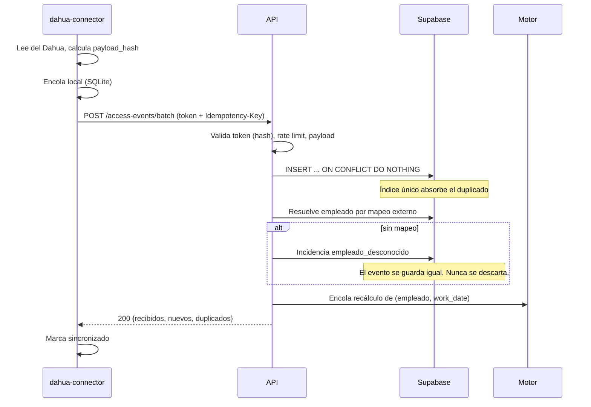
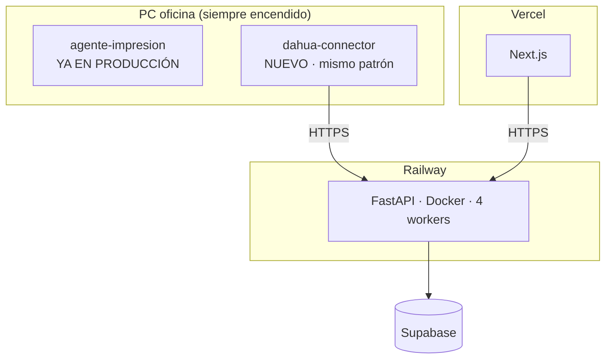

# Arquitectura — Módulo Personal (Tiempo, Asistencia y Permisos)

MALE DENIM OS · Fase 1 (diseño)

---

## 1. Vista general

```mermaid
graph TB
  subgraph LAN["Red local MALE DENIM"]
    DA[Dahua<br/>reconocimiento facial]
    CN[dahua-connector<br/>Python + SQLite]
    DA -->|LAN privada| CN
  end

  subgraph Railway["Railway · FastAPI"]
    API[api/personal.py]
    ING[personal_eventos.py<br/>ingesta idempotente]
    MOT[personal_motor.py<br/>FUNCIÓN PURA]
    SVC[personal_asistencia.py<br/>permisos · compensaciones]
    CRON[personal_scheduler.py]
  end

  subgraph Supabase
    RAW[(eventos_crudos<br/>INMUTABLE)]
    JOR[(jornadas<br/>derivada)]
    LIB[(libro_tiempo<br/>append-only)]
    NOV[(novedades<br/>propuestas)]
  end

  subgraph Vercel["Vercel · Next.js"]
    UI[/personal/**]
    MT[/personal/mi-tiempo]
  end

  CN -->|HTTPS saliente<br/>token + idempotencia| API
  API --> ING --> RAW
  RAW --> MOT
  JOR & LIB --> MOT
  MOT --> JOR
  SVC --> LIB --> NOV
  CRON -.recálculo nocturno.-> MOT
  UI & MT -->|JWT| API
```

**Regla de oro del flujo:** el Dahua reporta *hechos*; MALE DENIM OS produce
*interpretaciones*. Las dos cosas viven en tablas distintas y nunca se mezclan.

---

## 2. Capas

| Capa | Archivo | Responsabilidad | Toca Supabase |
|---|---|---|---|
| Router | `backend/api/personal.py` | Auth, RBAC, validación Pydantic, HTTP | No |
| Ingesta | `services/personal_eventos.py` | Idempotencia, mapeo, encolado | Sí |
| **Motor** | `services/personal_motor.py` | **Cálculo puro** | **No** |
| Asistencia | `services/personal_asistencia.py` | Orquesta motor + persistencia | Sí |
| Permisos | `services/personal_permisos.py` | FSM, aprobaciones, libro | Sí |
| Compensación | `services/personal_compensacion.py` | Planes, bloques, validación | Sí |
| Nómina | `services/personal_nomina.py` | Novedades, cierres, exportación | Sí |
| Reglas | `services/personal_reglas.py` | Resolución por especificidad | Sí (con caché) |
| Dispositivos | `services/personal_dispositivos.py` | Salud, tokens, reprocesamiento | Sí |
| Adaptadores | `integrations/dahua/*.py` | `AccessControlProvider` | No |

Espeja la separación que ya usa producción: el router nunca habla con Supabase,
el servicio nunca importa FastAPI.

### Por qué el motor es una función pura

`personal_motor.py` recibe datos y devuelve datos. Sin I/O, sin cliente Supabase,
sin fecha del sistema (el "ahora" se inyecta).

Tres consecuencias:

1. **Los 36 casos de prueba corren sin base de datos** — como ya se hace en
   `test_postventa_logic.py`, que prueba el FSM sin tocar Supabase.
2. **La idempotencia es demostrable**, no una aspiración.
3. **El recálculo masivo es barato**: se cargan los insumos una vez y se itera.

```python
def calcular_jornada(
    *, empleado: Empleado, work_date: date, horario: HorarioDia | None,
    eventos: list[EventoCrudo], permisos: list[PermisoAprobado],
    compensaciones: list[BloqueCompensacion], extras: list[ExtraAprobada],
    festivos: set[date], reglas: ReglasResueltas, ahora: datetime,
) -> ResultadoJornada:      # jornada + segmentos + incidencias + explicación
    ...
```

---

## 3. Ingesta de eventos



**Idempotencia en dos niveles**, según lo que entregue el equipo:

| Nivel | Clave | Cuándo |
|---|---|---|
| 1 | `(dispositivo_id, id_evento_externo)` | El Dahua da id de evento |
| 2 | `(dispositivo_id, id_externo, timestamp, payload_hash)` | No lo da |

Ambos son índices **parciales** en Postgres, así que solo aplica el que
corresponde. El reenvío es seguro por construcción: el `ON CONFLICT DO NOTHING`
lo absorbe sin error.

**Un evento nunca se descarta.** Si no se puede mapear a un empleado, se guarda
con `empleado_id = NULL` y se levanta incidencia. Cuando alguien crea el mapeo,
se reprocesa y el evento se recupera.

---

## 4. Contrato de API

Prefijo `/api/personal` — coherente con `/api/produccion`, `/api/postventa`.

### Autoservicio (todo usuario enlazado a un empleado)

```
GET   /api/personal/mi-tiempo                      resumen de hoy
GET   /api/personal/mi-tiempo/historial            jornadas propias
GET   /api/personal/mi-tiempo/saldo                extracto del libro
GET   /api/personal/mi-tiempo/permisos             permisos propios
POST  /api/personal/mi-tiempo/permisos             solicitar
POST  /api/personal/mi-tiempo/permisos/:id/enviar
POST  /api/personal/mi-tiempo/permisos/:id/cancelar
POST  /api/personal/mi-tiempo/compensacion         proponer bloques
POST  /api/personal/mi-tiempo/incidencias          reportar corrección
```

`empleado_id` sale **siempre** del JWT. Nunca es parámetro.

### Empleados · Horarios · Configuración

```
GET   /api/personal/empleados                      ?area&sede&estado&q&limit
POST  /api/personal/empleados
GET   /api/personal/empleados/:id
PATCH /api/personal/empleados/:id
GET   /api/personal/horarios
POST  /api/personal/horarios
PATCH /api/personal/horarios/:id
POST  /api/personal/horarios/:id/asignar           empleado + vigencia
GET   /api/personal/turnos                         ?desde&hasta&empleado
POST  /api/personal/turnos                         turno planificado (tienda)
GET   /api/personal/reglas
PATCH /api/personal/reglas/:clave
GET   /api/personal/festivos
```

### Asistencia

```
GET   /api/personal/asistencia                     ?desde&hasta&empleado&area&estado
GET   /api/personal/asistencia/:empleadoId/:fecha  incluye explicación
POST  /api/personal/asistencia/recalcular          rango + alcance
POST  /api/personal/asistencia/:id/aprobar
```

### Permisos · Compensaciones · Extras

```
GET   /api/personal/permisos                       filtrado por alcance del rol
POST  /api/personal/permisos
GET   /api/personal/permisos/:id
PATCH /api/personal/permisos/:id
POST  /api/personal/permisos/:id/enviar
POST  /api/personal/permisos/:id/aprobar-jefe
POST  /api/personal/permisos/:id/rechazar-jefe
POST  /api/personal/permisos/:id/aprobar-th
POST  /api/personal/permisos/:id/rechazar-th
POST  /api/personal/permisos/:id/cancelar
GET   /api/personal/compensaciones
POST  /api/personal/compensaciones/:id/bloques
POST  /api/personal/compensaciones/:id/validar
POST  /api/personal/compensaciones/:id/prorrogar   exige motivo
GET   /api/personal/extras
POST  /api/personal/extras
POST  /api/personal/extras/:id/aprobar
POST  /api/personal/extras/:id/rechazar
```

### Incidencias · Dispositivos · Nómina · Reportes

```
GET   /api/personal/incidencias                    ?estado&tipo&empleado&desde
POST  /api/personal/incidencias
POST  /api/personal/incidencias/:id/resolver
POST  /api/personal/incidencias/:id/rechazar

GET   /api/personal/dispositivos                   IP/serial enmascarados
POST  /api/personal/dispositivos
PATCH /api/personal/dispositivos/:id
POST  /api/personal/dispositivos/:id/probar
POST  /api/personal/dispositivos/:id/sincronizar
POST  /api/personal/dispositivos/:id/rotar-token
GET   /api/personal/dispositivos/:id/salud
POST  /api/personal/access-events                  ← conector
POST  /api/personal/access-events/batch            ← conector
GET   /api/personal/access-events                  ?dispositivo&estado&desde
POST  /api/personal/access-events/reprocesar

GET   /api/personal/periodos
POST  /api/personal/periodos/:id/cerrar
POST  /api/personal/periodos/:id/reabrir           exige motivo
GET   /api/personal/novedades                      ?periodo&estado&tipo
POST  /api/personal/novedades/:id/revisar
POST  /api/personal/novedades/exportar             registra usuario + filtros

GET   /api/personal/dashboard
GET   /api/personal/calendario                     ?desde&hasta&area&sede
GET   /api/personal/reportes/:tipo                 16 reportes
GET   /api/personal/reportes/:tipo/xlsx
```

### Convenciones (heredadas del repo)

- `limit` con `Query(default, ge, le)`. Sin offset — el volumen no lo amerita
  (25 empleados × 365 días ≈ 9k filas/año).
- Respuestas `-> dict`, sin `response_model` (convención del proyecto).
- Errores: `ValueError` del servicio → `HTTPException(400, str(e))` con códigos
  snake_case (`permiso_vencido`, `transicion_invalida`, `periodo_cerrado`).
- Modelos Pydantic inline, encima del bloque de endpoints que los usan.

### Endpoints del conector: seguridad reforzada

Los dos endpoints de ingesta no usan JWT de usuario:

| Control | Implementación |
|---|---|
| Autenticación | Token por dispositivo, comparado contra `token_hash` (bcrypt) |
| Idempotencia | Header `Idempotency-Key` + índices únicos |
| Rate limiting | Ventana por dispositivo |
| Anti-replay | Se rechaza `event_timestamp` con desviación > 24 h; se alerta |
| Validación | Pydantic estricto; payload > 1 MB rechazado |
| Auditoría | Cada lote deja registro con `correlation_id` |
| Rotación | `POST /rotar-token` invalida el anterior |

---

## 5. Recálculo

**Disparo inmediato** — al llegar un evento, aprobarse un permiso, cambiar un
horario o resolverse una incidencia, se marca `(empleado_id, work_date)` como
sucia y se recalcula.

**Barrido nocturno** — `personal_scheduler.py`, 3:00 AM Bogotá, siguiendo el
patrón de `produccion_scheduler.py` (thread daemon + `threading.Event`, sin
broker). Recalcula los últimos N días no bloqueados y detecta:

- jornadas sin cerrar (falta salida)
- compensaciones próximas a vencer y vencidas
- dispositivos sin contacto
- solicitudes pendientes hace demasiado

Corre solo en el worker líder (lock `/tmp/maledenim-leader.lock`).

> **Limitación conocida.** El lock es local al contenedor: con 2+ réplicas de
> Railway, cada una elegiría líder y el cron correría dos veces. **No rompe
> nada** porque el recálculo es idempotente (I2) — pero duplicaría notificaciones.
> Por eso la deduplicación de notificaciones es persistente (§7), no en memoria
> como la de Slack.

---

## 6. Resolución de reglas

De la más específica a la más general:

```
empleado > horario > tipo_contrato > area > sede > empresa
```

La primera coincidencia gana. Una regla a nivel `empleado` exige `motivo` — lo
obliga un CHECK en la base de datos. Se cachea en memoria con TTL 60 s, usando
`_cache_get/_cache_set` como en `produccion.py`, y se invalida al editar.

---

## 7. Notificaciones

Se reusa lo existente: Resend (correo) y WhatsApp Cloud API. No se construye
sistema nuevo.

| Evento | Destino | Canal |
|---|---|---|
| Solicitud enviada | Jefe | Correo |
| Aprobada / rechazada | Empleado | Correo + WhatsApp |
| Pendiente > 48 h | Jefe + TH | Correo |
| Compensación por vencer | Empleado + jefe | Correo + WhatsApp |
| Compensación vencida | TH | Correo |
| Incidencia detectada | Empleado + jefe | Correo |
| Dispositivo desconectado > 1 h | Admin técnico | Correo |
| Periodo próximo a cierre | TH + Nómina | Correo |

**Deduplicación persistente.** La dedup de Slack existente vive en un dict en
memoria y se pierde en cada redeploy. Para este módulo se usa una tabla con
`(tipo_notificacion, entidad_id, ventana)`, para que un reinicio —o una segunda
réplica— no reenvíe. Sin esto, "compensación por vencer" podría notificar cada
15 minutos.

---

## 8. Frontend

Sigue el patrón del repo sin excepción: `"use client"`, React Query con
`queryKey: ["personal", recurso, ...]`, `PageShell` / `LoadingState` /
`ErrorState`, `KpiCard`, tablas HTML con las clases de marca, formularios con
`useState` + `useMutation` (sin librería de forms).

**Gráficos.** `recharts` está instalado pero con 0 imports; los sparklines
actuales son SVG a mano duplicados en dos páginas. Para los 7 gráficos del
dashboard propongo **estrenar recharts** —ya es dependencia, no suma peso— en
lugar de escribir SVG a mano. Es una decisión que conviene confirmar, porque
introduce un patrón nuevo en el frontend.

**Exportación.** `exportarExcel()` (CSV `;` + BOM) para lo tabular; openpyxl en
el servidor para los reportes de nómina con formato.

---

## 9. Feature flags

| Flag | Dónde | Default | Controla |
|---|---|---|---|
| `TIME_MANAGEMENT_ENABLED` | Railway | `false` | Router, servicios y crons del backend |
| `NEXT_PUBLIC_TIME_MANAGEMENT_ENABLED` | Vercel | `false` | Grupo "Personal" del menú |

> **Dos flags, no uno.** Backend y frontend son despliegues distintos, así que
> el flag de Railway no alcanza al menú de Vercel. Hace falta el par porque
> "Mi tiempo" no exige permiso —es el autoservicio— y sin el gate del frontend
> le aparecería a todo el mundo apuntando a una página que aún no existe.
> **Se activan juntos, y solo cuando las páginas de la Fase 5 estén desplegadas.**

| Flag adicional | Default | Controla |
|---|---|---|
| `DAHUA_CONNECTOR_ENABLED` | `false` | Endpoints de ingesta |
| `PAYROLL_EXPORT_ENABLED` | `false` | Exportación a nómina |
| `TIME_MANAGEMENT_AI_INSIGHTS_ENABLED` | `false` | Hallazgos descriptivos |

> **Corregir al implementar.** El repo tiene hoy tres formas distintas de parsear
> flags, y una de ellas hace que `BOT_AUTO_ENABLED=1` **no** active nada (compara
> con `"true"` exacto). Los flags de este módulo usarán un helper único que
> acepte `true/1/yes/on`.

---

## 10. Despliegue



El backend y el frontend no cambian de forma de despliegue. El conector es un
artefacto nuevo, pero se instala igual que el agente de impresión que ya está
funcionando: copiar carpeta, crear `config.json`, doble clic.

**Nota de entorno.** Railway corre **Python 3.10** (el `Dockerfile` gana sobre
`runtime.txt`). Este módulo es puro manejo de timestamps, así que depende de
`backend/core/timeutils.py` — que hoy existe solo sin commitear y **no está en
producción**. Aterrizarlo es prerrequisito de la Fase 2.

---

## 11. Observabilidad

- Logs estructurados con `correlation_id` que atraviesa conector → API → motor.
- `GET /api/personal/dispositivos/:id/salud`: último contacto, último evento,
  eventos pendientes, errores 24 h, versión del conector.
- Métricas: eventos recibidos/procesados/fallidos, latencia de sincronización,
  jornadas recalculadas, incidencias abiertas por tipo.
- Alertas: dispositivo sin contacto > 1 h, cola > umbral, tasa de error anormal.
- **Nunca se registra**: tokens, biométricos, documentos de identidad, contraseñas.

---

## Documentos relacionados

`TIME_MANAGEMENT_DOMAIN_RULES.md` · `TIME_MANAGEMENT_RBAC.md` ·
`DAHUA_INTEGRATION_REQUIREMENTS.md` · `TIME_MANAGEMENT_IMPLEMENTATION_PLAN.md` ·
`SUPABASE_MIGRATION_PERSONAL.sql`
