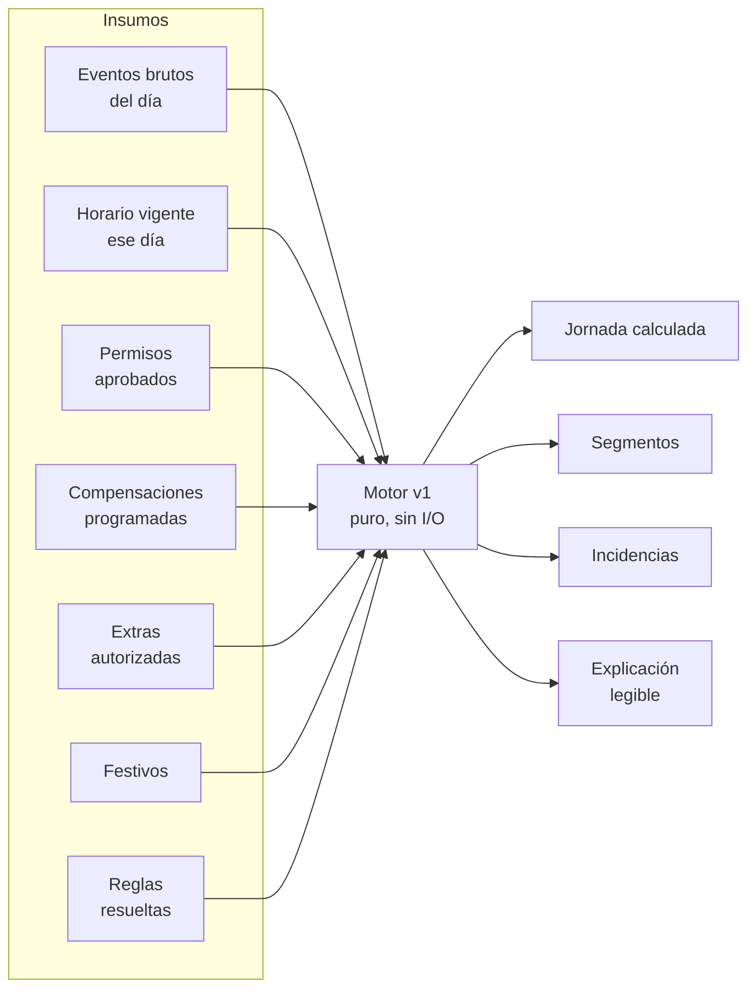
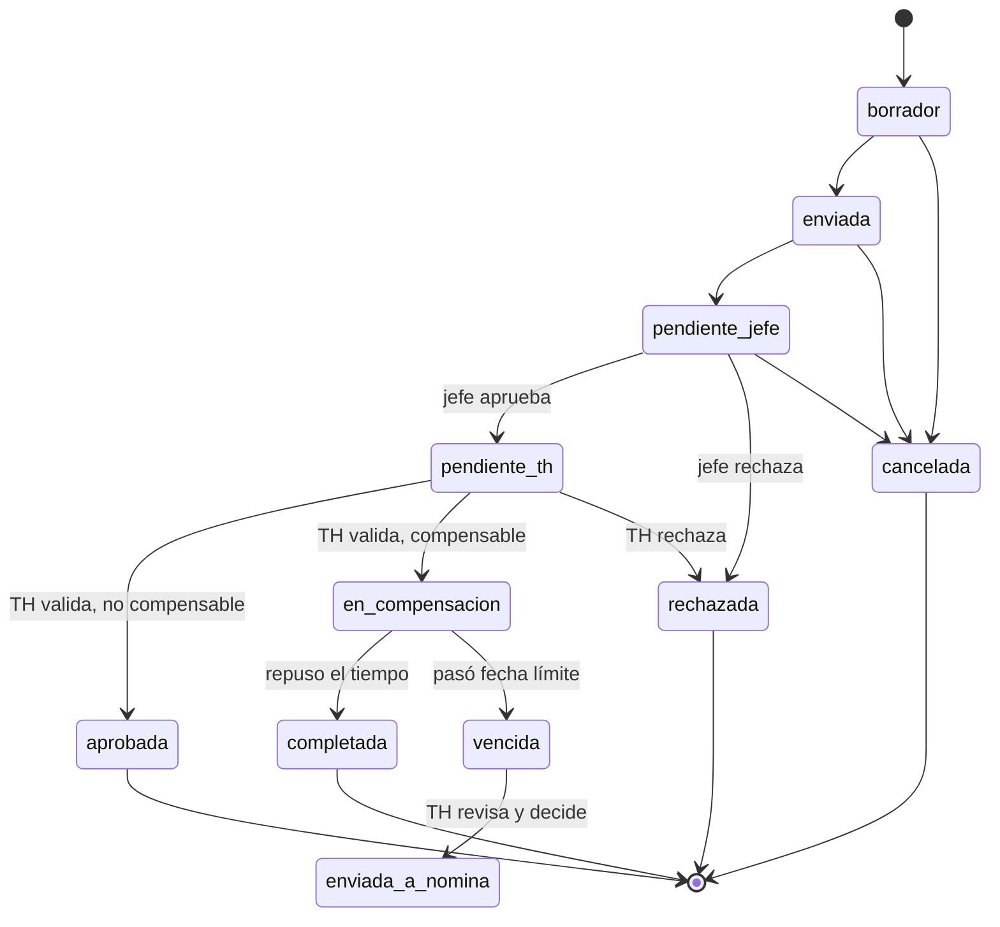
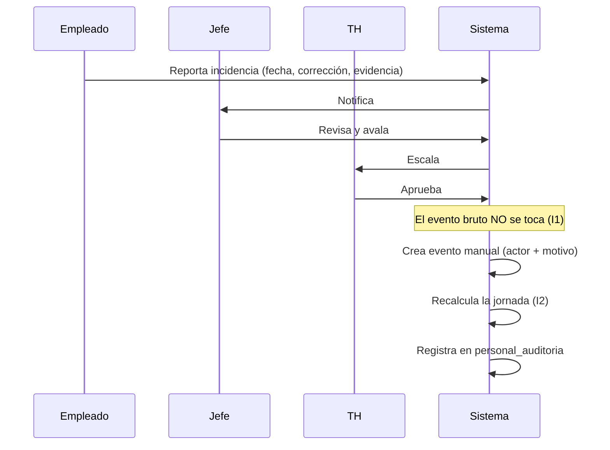

# Reglas de Dominio — Gestión de Tiempo, Asistencia y Permisos

> **Aviso legal.** Este documento traduce prácticas laborales a reglas de software.
> No es asesoría jurídica. Las referencias al Código Sustantivo del Trabajo son
> orientativas y **deben ser validadas por un abogado laboral colombiano** antes
> del lanzamiento, junto con un especialista en protección de datos para la parte
> biométrica. Ver `BIOMETRIC_DATA_HANDLING.md`.

Módulo: **Personal** · MALE DENIM OS · Fase 1 (diseño)

---

## 1. Los cuatro invariantes

Todo lo demás en el módulo se deriva de estos cuatro enunciados. Si un cambio
futuro los contradice, el cambio está mal.

### I1 — El evento bruto es sagrado

`personal_eventos_crudos` es append-only. Nunca se edita un `event_timestamp`,
nunca se borra una marcación "equivocada", nunca se reescribe un payload.

Corregir una marcación produce: una **incidencia** + un **evento nuevo de origen
manual** con actor y motivo. El hecho original permanece.

*Por qué:* si el registro base se puede editar, cualquier cifra derivada es
opinable, y el sistema deja de servir como prueba ante una discusión laboral.

### I2 — El cálculo es determinista e idempotente

Dado el mismo conjunto de (eventos, horario vigente, permisos aprobados, reglas,
festivos), el motor produce **exactamente** el mismo resultado, siempre.

`personal_jornadas` es derivada y desechable: se puede borrar completa y
reconstruir. Recalcular dos veces no cambia nada ni duplica nada.

*Por qué:* es la única forma de reprocesar sin miedo cuando llega un evento
atrasado, se aprueba un permiso retroactivo o se corrige un horario. También es
lo que sustituye a las transacciones, que Supabase no ofrece: si una escritura
queda a medias, el recálculo la corrige.

### I3 — El saldo no se edita

`personal_libro_tiempo` es append-only. El saldo de un empleado **es** la suma de
sus asientos vigentes, nunca una columna almacenada.

Corregir un asiento equivocado = asiento de `reversion` que lo apunta + asiento
nuevo. Un ajuste manual exige `aprobado_por` no nulo — lo obliga un CHECK en la
base de datos, no una convención.

*Por qué:* un saldo editable es un saldo negociable. Con libro mayor, cada minuto
tiene origen, aprobador y fecha, y la historia de las correcciones queda visible.

### I4 — Nómina siempre pasa por un humano

Las novedades nacen en estado `propuesta`. El sistema jamás descuenta, paga ni
sanciona por su cuenta. La IA (Fase 8, tras flag) describe patrones; no decide.

*Por qué:* un descuento automático mal calculado es un problema legal y de
confianza. El sistema propone y explica; la persona decide.

---

## 2. La regla que más se viola en estos sistemas

> **La permanencia no es tiempo a favor.**

El Dahua sabe que alguien cruzó una puerta. No sabe si trabajó, si esperaba la
lluvia, si se quedó conversando o si estaba haciendo un turno extra autorizado.

Por eso **ninguno** de estos hechos genera crédito automático:

| Hecho observado | Qué produce el sistema |
|---|---|
| Llega 40 min antes | `minutos_posible_extra`, nada más |
| Se va 1 hora después | `minutos_posible_extra` + incidencia `posible_hora_extra` |
| Permanece en el almuerzo | Nada. No es trabajo. |
| Marca dos veces seguidas | Incidencia `evento_duplicado` |
| Trabaja un domingo sin autorización | `minutos_dominical_festivo` + incidencia |
| Marca sin horario asignado | Incidencia `horario_no_encontrado` |

El crédito solo aparece cuando existe **autorización previa clasificada**:
`personal_solicitudes_extra.estado = 'aprobada'` o
`personal_bloques_compensacion` validado contra marcaciones reales.

La separación vive en el esquema: `minutos_posible_extra` (hecho) y
`minutos_extra_aprobada` (decisión) son columnas distintas y el motor nunca
copia la primera en la segunda.

---

## 3. Taxonomía de tiempo

Las once categorías de la especificación, con su tratamiento:

| # | Categoría | Remunerado | Compensable | Efecto en nómina |
|---|---|---|---|---|
| 1 | Jornada ordinaria | Sí | — | Ninguno |
| 2 | Permiso legal remunerado | Sí | **Nunca** | Ninguno |
| 3 | Permiso empresarial remunerado | Sí | Configurable | Ninguno |
| 4 | Permiso personal compensable | Sí | **Sí** | Solo si vence sin reponer |
| 5 | Permiso no remunerado | No | No | Descuento propuesto |
| 6 | Trabajo suplementario | Sí | No | Recargo |
| 7 | Hora extra | Sí | No | Recargo (requiere autorización) |
| 8 | Recargo nocturno | Sí | No | Recargo |
| 9 | Dominical / festivo | Sí | No | Recargo |
| 10 | Permanencia no autorizada | — | **No** | Ninguno. Solo incidencia. |
| 11 | Incidencia de asistencia | — | — | Ninguno hasta resolverse |

### La restricción que protege al trabajador

Un permiso legal **nunca** puede volverse deuda de tiempo. Convertir una licencia
de luto, una cita médica obligatoria o el ejercicio del voto en horas por reponer
sería contrario a la ley.

Esto no depende de que nadie configure bien la pantalla. Está en la base de datos:

```sql
CHECK (NOT (categoria = 'legal_remunerado' AND es_compensable = TRUE))
```

Tipos legales a sembrar (a confirmar con el abogado): licencia de luto (CST 57
num. 10), licencia de maternidad/paternidad, calamidad doméstica comprobada,
ejercicio del sufragio (Ley 403/1997), citación judicial, licencia sindical.

---

## 4. Motor de interpretación

### 4.1 Insumos y salidas



El motor es una **función pura**: recibe datos, devuelve datos. No lee de
Supabase ni escribe. Eso lo hace trivialmente testeable — los 36 casos de prueba
se ejecutan sin base de datos, como ya se hace en `test_postventa_logic.py`.

### 4.2 Resolución del horario del día

En orden estricto de precedencia:

1. `personal_turnos_planificados` para (empleado, fecha) → turno rotativo de tienda
2. `personal_asignacion_horario` vigente + `personal_horario_dias` del día de semana
3. **Ninguno** → incidencia `horario_no_encontrado`, jornada en `sin_datos`

Nunca se asume un horario por defecto. Un empleado sin horario asignado es un
problema de configuración que alguien debe ver, no un cálculo que inventar.

**Vigencia histórica.** `personal_asignacion_horario` nunca se edita: al cambiar
de horario se cierra la asignación vigente (`valid_to`) y se abre otra. Así un
recálculo de marzo usa el horario que regía en marzo, no el de hoy.

### 4.3 Emparejamiento de eventos → segmentos

```
eventos ordenados por event_timestamp
  ↓ descartar duplicados dentro de la ventana de tolerancia (30 s por defecto)
  ↓ resolver dirección según modo_direccion del dispositivo
  ↓ emparejar entrada→salida por pila
  ↓ entrada sin salida  → incidencia falta_salida,  segmento 'abierto'
  ↓ salida sin entrada  → incidencia falta_entrada, segmento 'inferido'
```

**Nunca se inventa una hora.** Un segmento sin cierre queda `abierto` y no aporta
minutos trabajados. La corrección la hace una persona, con soporte y auditoría.

### 4.4 Anclaje a la fecha de negocio

Una jornada pertenece a la **fecha en que empieza**, no a la del reloj. Un turno
que entra el lunes 22:00 y sale el martes 06:00 es la jornada del **lunes**.

`personal_horario_dias.cruza_medianoche` marca esos turnos. `work_date` es una
columna explícita: nunca se deriva de `event_timestamp::date`.

### 4.5 Aritmética

```
minutos_trabajados       = Σ segmentos tipo 'trabajo' cerrados
minutos_tarde            = max(0, primera_entrada − inicio_programado − tolerancia)
minutos_salida_anticipada= max(0, fin_programado − ultima_salida − tolerancia)
minutos_exceso_descanso  = max(0, descanso_real − minutos_descanso)
minutos_posible_extra    = max(0, minutos_trabajados − minutos_esperados)   ← HECHO
minutos_extra_aprobada   = min(extra_autorizada, minutos_posible_extra)     ← DECISIÓN
```

La última línea es la que importa: se reconoce **el mínimo** entre lo autorizado
y lo efectivamente trabajado. Autorizar 2 horas y trabajar 1 paga 1. Trabajar 3
con 2 autorizadas paga 2, y la hora restante queda como incidencia para revisión.

Un permiso aprobado que cubre parte del día **reduce** `minutos_esperados`; no
suma minutos trabajados. Alguien con permiso de 2 horas y jornada de 8 debe 6.

### 4.6 Cuándo se recalcula

- Llega un evento nuevo (incluso atrasado) para esa fecha
- Cambia el horario o el turno planificado
- Se aprueba, rechaza o cancela un permiso que toca esa fecha
- Se aprueba una corrección de marcación
- Se aprueba o ejecuta una hora extra
- Cambia una regla que aplica a ese empleado
- Un administrador pide reprocesar

**Excepción:** una jornada con `bloqueado_at` pertenece a un periodo cerrado y no
se recalcula. Requiere reabrir el periodo, con motivo y auditoría.

---

## 5. Ciclo de vida del permiso



Se implementa con el patrón formal que ya existe en el repo
(`postventa_logic.py`): diccionario `TRANSICIONES` + `transicion_valida()`, y
cada cambio deja rastro en `personal_auditoria`.

**Validaciones al enviar** — cruce contra: horario del día, vacaciones,
incapacidades, otros permisos del mismo empleado, días no laborables, periodos
cerrados y los límites configurados por tipo.

**Doble aprobación.** El jefe evalúa la **afectación operativa** ("¿puedo cubrir
la tienda sin esta persona?"). TH valida la **clasificación** ("¿esto es calamidad
o permiso personal?"). Son juicios distintos y por eso son dos pasos.

TH puede reclasificar: el empleado pide "permiso personal compensable" y TH lo
convierte en "calamidad doméstica" — que es legal, remunerado y **no**
compensable. `clasificacion_final` guarda esa decisión.

---

## 6. Compensación

Solo aplica a `categoria = 'personal_compensable'`.

1. Al aprobarse, se crea `personal_planes_compensacion` y un asiento
   `permiso_debito` en el libro de tiempo.
2. El empleado propone bloques (`personal_bloques_compensacion`); el jefe aprueba.
3. **La validación es contra marcaciones reales.** `minutos_reales` se llena solo
   desde `personal_jornadas`. Programar no es compensar.
4. Al cubrirse el total: asiento `compensacion_credito`, plan `completado`,
   permiso `completada`.
5. Si vence: plan `vencido` + novedad `compensacion_vencida` en estado
   **`propuesta`**. TH decide si prorroga, condona o descuenta. El sistema no
   descuenta solo (I4).

Valores iniciales sugeridos — **configurables, no definitivos**:

| Regla | Sugerido |
|---|---|
| `tolerancia_ingreso_min` | 5 min |
| `tolerancia_duplicado_seg` | 30 s |
| `salida_intermedia_significativa_min` | 10 min |
| `max_minutos_compensables` | 480 (8 h) |
| `plazo_compensacion` | misma semana |
| `prorroga_maxima` | cierre de quincena |
| `requiere_autorizacion_previa` | sí |
| `bloquear_compensacion_vencida` | sí |
| `conversion_automatica_a_descuento` | **no** |
| `requiere_revision_humana_nomina` | **sí** |
| `banco_positivo_automatico` | **no** |

---

## 7. Horas extras

1. Requieren autorización **previa**. `momento_autorizacion = 'posterior'` existe
   para contingencias reales y queda marcado para revisión de TH.
2. Las marcaciones prueban **permanencia**, no autorización.
3. Se reconoce `min(autorizado, trabajado)`.
4. Se clasifican para el recargo: diurna, nocturna, dominical, festiva.
5. Producen novedad `propuesta`. Nunca saldo positivo.

Las horas extras viven en tabla propia, **fuera del libro de tiempo**, a
propósito: la hora extra se paga, no se acumula como saldo compensable.
Mezclarlas es el error clásico de estos sistemas.

---

## 8. Corrección de marcación



El evento original permanece. La corrección es un registro **adicional** de
origen `manual`, con `registrado_por` y `motivo_manual` obligatorios.

---

## 9. Seguridad del dato

- Las plantillas biométricas **nunca** salen del Dahua. MALE DENIM OS solo
  guarda `id_externo_empleado`.
- Las fotos no se almacenan por defecto (`referencia_snapshot` es una referencia,
  no la imagen).
- El token del conector se guarda hasheado, igual que `password_hash`.
- Serial e IP se devuelven enmascarados salvo a `personal_dispositivos:ver`.
- Ningún log incluye tokens, biométricos ni documentos de identidad.
- El consentimiento de tratamiento de datos se registra en
  `personal_empleados.consentimiento_datos_at`.

Sin RLS en este proyecto, la vista "el empleado ve solo lo suyo" se hace cumplir
en el backend: `empleado_id` se deriva **siempre** del JWT, nunca de un parámetro
del request. Cada endpoint de autoservicio lleva su test de aislamiento.

---

## 10. Pruebas que blindan los invariantes

Además de los 36 casos funcionales, la suite prueba explícitamente:

| Test | Invariante |
|---|---|
| `test_eventos_crudos_inmutables` | I1 |
| `test_correccion_no_modifica_evento_original` | I1 |
| `test_recalculo_idempotente` | I2 |
| `test_evento_duplicado_no_altera_resultado` | I2 |
| `test_libro_tiempo_no_editable` | I3 |
| `test_correccion_exige_reversion` | I3 |
| `test_llegar_antes_no_genera_credito` | §2 |
| `test_salir_tarde_no_genera_credito` | §2 |
| `test_extra_sin_autorizacion_no_se_reconoce` | §7 |
| `test_permiso_legal_no_es_compensable` | §3 |
| `test_novedad_nace_como_propuesta` | I4 |
| `test_empleado_no_ve_asistencia_ajena` | §9 |

---

## Referencias

- `TIME_MANAGEMENT_ARCHITECTURE.md` — capas y despliegue
- `TIME_MANAGEMENT_RBAC.md` — matriz de permisos
- `DAHUA_INTEGRATION_REQUIREMENTS.md` — qué falta para la integración real
- `BIOMETRIC_DATA_HANDLING.md` — tratamiento de datos sensibles
- `SUPABASE_MIGRATION_PERSONAL.sql` — DDL
