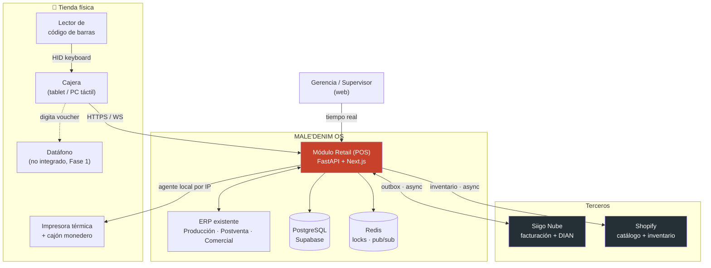
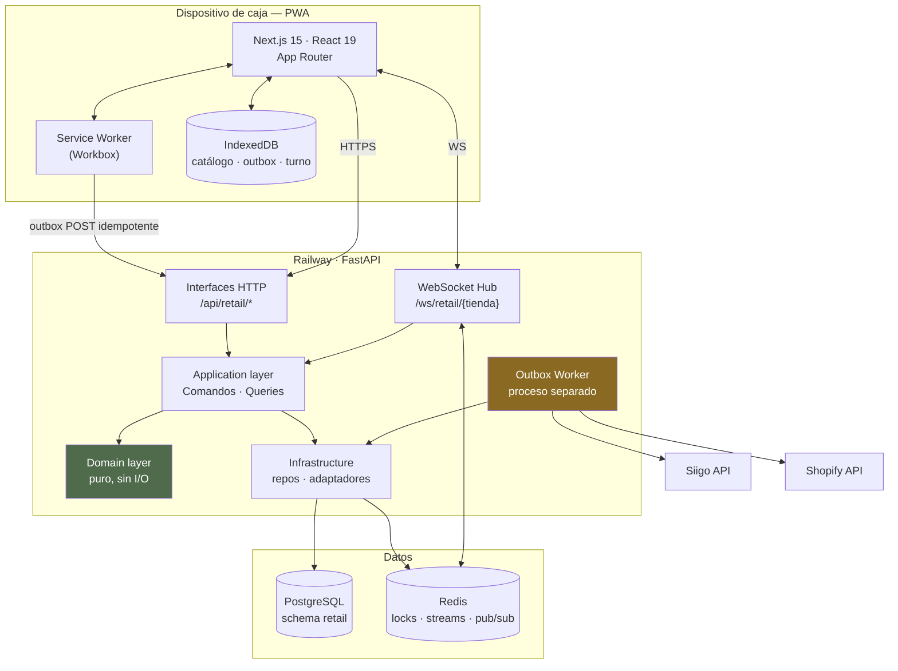
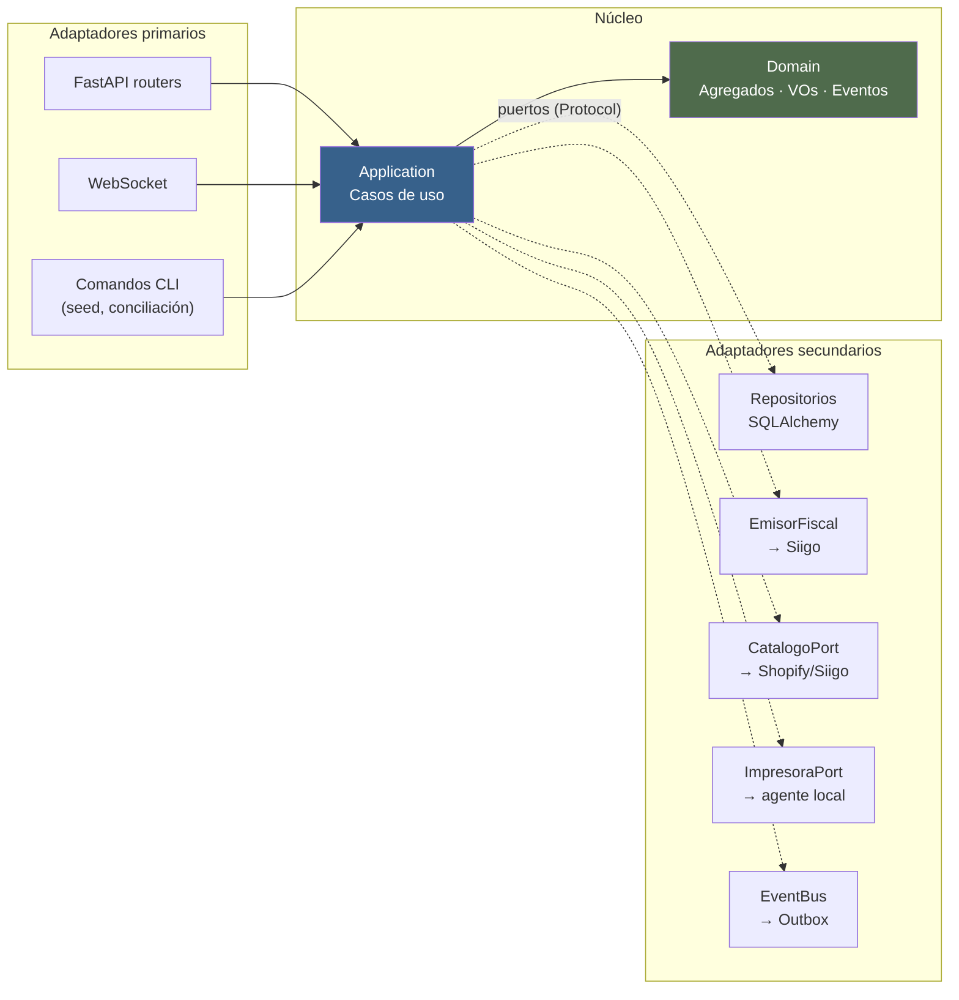

# 01 · Arquitectura

---

## 1. Principio rector

> **El módulo retail es hexagonal por dentro y un router más de FastAPI por fuera.**

No se reescribe MALE'DENIM OS. Se aplica *strangler pattern*: el módulo nuevo nace con la
arquitectura correcta, y el ERP existente sigue exactamente como está. El día que otro
módulo quiera migrar, hay un ejemplo funcionando al lado.

La razón de aplicar Clean Architecture **aquí y no en el resto**: el POS es el único módulo
donde una regla de negocio mal aplicada produce un descuadre de dinero o un documento ante
la DIAN. El costo de la disciplina se paga solo.

---

## 2. Vista de contexto (C4 nivel 1)



**Lectura clave:** las flechas hacia Siigo y Shopify son **asíncronas**. Ninguna venta
espera a un tercero.

---

## 3. Vista de contenedores (C4 nivel 2)



### Por qué el Outbox Worker es un **proceso separado**

Hoy los schedulers corren dentro del proceso web con elección de líder por archivo en `/tmp`
(`backend/main.py:73`). Eso funciona con varios workers en una máquina y **se rompe con dos
réplicas de Railway**: dos líderes, dos emisiones del mismo documento fiscal.

Para el POS eso es inaceptable: un documento fiscal duplicado es un problema ante la DIAN.
→ El worker de outbox es un **servicio Railway aparte con una sola réplica**, y toma un
`pg_advisory_lock` por si acaso. La emisión fiscal nunca depende de una carrera.

---

## 4. Capas del módulo (hexagonal)



**Regla de dependencia, sin excepciones:**

```
interfaces  →  application  →  domain
infrastructure  →  application  →  domain
domain  →  (nada)
```

`domain/` no importa FastAPI, ni SQLAlchemy, ni `httpx`, ni `supabase`. Se testea sin base de
datos y sin red. Esto se **verifica automáticamente** en CI con un test que analiza los
imports (ver §8).

---

## 5. Estructura de carpetas

### Backend

```
backend/
├── main.py                          # ← se agrega: app.include_router(retail.router)
├── api/                             # ERP existente, intacto
├── services/                        # ERP existente, intacto
├── core/
│   ├── security.py                  # ← se extiende: require_retail_permission()
│   └── config.py                    # ← se extiende: settings de retail
│
└── modules/
    └── retail/                      # ══ EL MÓDULO ══
        │
        ├── domain/                  # ⛔ CERO I/O. Cero imports de framework.
        │   ├── shared/
        │   │   ├── dinero.py                 # VO Dinero (entero en centavos)
        │   │   ├── identificadores.py        # VentaId, TiendaId, … (ULID)
        │   │   ├── cantidad.py
        │   │   ├── evento.py                 # EventoDominio (base)
        │   │   └── errores.py                # ViolacionInvariante, ReglaNegocio
        │   │
        │   ├── venta/
        │   │   ├── venta.py                  # AGREGADO RAÍZ
        │   │   ├── linea_venta.py            # Entidad hija
        │   │   ├── pago.py                   # Entidad hija
        │   │   ├── descuento.py              # VO
        │   │   ├── numero_ticket.py          # VO
        │   │   ├── estados.py                # EstadoVenta (enum + transiciones)
        │   │   ├── politicas.py              # PoliticaDescuento, PoliticaRedondeo
        │   │   └── eventos.py                # VentaCerrada, VentaAnulada, …
        │   │
        │   ├── caja/
        │   │   ├── sesion_caja.py            # AGREGADO RAÍZ
        │   │   ├── movimiento_caja.py
        │   │   ├── arqueo.py                 # VO: conteo declarado vs esperado
        │   │   └── eventos.py
        │   │
        │   ├── inventario/
        │   │   ├── saldo_ubicacion.py        # AGREGADO RAÍZ
        │   │   ├── movimiento_inventario.py  # Asiento del libro mayor
        │   │   ├── motivo.py                 # VO enumerado, extensible
        │   │   └── eventos.py
        │   │
        │   ├── catalogo/
        │   │   ├── producto.py
        │   │   ├── variante.py               # AGREGADO RAÍZ (referencia+color+talla)
        │   │   ├── sku.py                    # VO con parsing de 93634-1T12
        │   │   └── precio.py
        │   │
        │   ├── cliente/
        │   │   ├── cliente.py                # AGREGADO RAÍZ
        │   │   ├── documento_identidad.py    # VO con validación de DV del NIT
        │   │   └── eventos.py
        │   │
        │   └── fiscal/
        │       ├── documento_fiscal.py       # AGREGADO RAÍZ
        │       ├── estados.py                # máquina de estados de emisión
        │       └── eventos.py
        │
        ├── application/                      # Orquestación. Sin reglas de negocio.
        │   ├── puertos/                      # Protocolos (interfaces)
        │   │   ├── repositorios.py
        │   │   ├── emisor_fiscal.py
        │   │   ├── catalogo.py
        │   │   ├── impresora.py
        │   │   ├── bus_eventos.py
        │   │   ├── reloj.py                  # ← inyectable: tests deterministas
        │   │   └── unidad_de_trabajo.py      # UnitOfWork
        │   │
        │   ├── comandos/                     # Escritura (CQRS · lado C)
        │   │   ├── abrir_sesion_caja.py
        │   │   ├── crear_venta.py
        │   │   ├── agregar_linea.py
        │   │   ├── modificar_cantidad.py
        │   │   ├── eliminar_linea.py
        │   │   ├── aplicar_descuento.py
        │   │   ├── registrar_pago.py
        │   │   ├── cerrar_venta.py           # ← el importante
        │   │   ├── anular_venta.py
        │   │   ├── registrar_movimiento_caja.py
        │   │   ├── cerrar_sesion_caja.py
        │   │   ├── crear_cliente.py
        │   │   ├── actualizar_cliente.py
        │   │   └── sincronizar_venta_offline.py
        │   │
        │   ├── consultas/                    # Lectura (CQRS · lado Q)
        │   │   ├── buscar_producto.py
        │   │   ├── stock_multitienda.py
        │   │   ├── historial_cliente.py
        │   │   ├── ventas_del_turno.py
        │   │   ├── arqueo_esperado.py
        │   │   ├── tablero_tiempo_real.py
        │   │   └── auditoria.py
        │   │
        │   ├── manejadores/                  # Reacciones a eventos de dominio
        │   │   ├── al_cerrar_venta.py        # → descarga stock, encola fiscal
        │   │   ├── al_emitir_documento.py    # → notifica caja, reimprime
        │   │   └── al_cerrar_sesion.py
        │   │
        │   └── dto/                          # Pydantic de entrada/salida
        │
        ├── infrastructure/
        │   ├── persistencia/
        │   │   ├── modelos.py                # SQLAlchemy ORM (schema retail)
        │   │   ├── unidad_de_trabajo.py      # UoW con AsyncSession
        │   │   ├── repo_venta.py
        │   │   ├── repo_sesion_caja.py
        │   │   ├── repo_inventario.py        # reserva atómica
        │   │   ├── repo_cliente.py
        │   │   ├── repo_catalogo.py
        │   │   ├── repo_fiscal.py
        │   │   ├── consecutivos.py           # arriendo de bloques
        │   │   └── auditoria.py              # append-only encadenado
        │   │
        │   ├── siigo/
        │   │   ├── emisor.py                 # ← envuelve EmisorSiigo existente
        │   │   ├── mapeador.py               # Venta → payload Siigo
        │   │   ├── limitador.py              # rate limiter con token bucket
        │   │   └── verificador.py            # relee el doc y compara (H5)
        │   │
        │   ├── shopify/
        │   │   ├── inventario.py             # publica stock
        │   │   └── mapeador.py
        │   │
        │   ├── impresion/
        │   │   ├── agente_local.py           # ← reutiliza AGENTE-IMPRESION
        │   │   └── plantilla_ticket.py       # ESC/POS
        │   │
        │   ├── redis/
        │   │   ├── locks.py
        │   │   └── pubsub.py
        │   │
        │   └── outbox/
        │       ├── despachador.py
        │       └── worker.py                 # entrypoint del servicio Railway
        │
        ├── interfaces/
        │   ├── http/
        │   │   ├── router.py                 # agrega todos los sub-routers
        │   │   ├── ventas.py
        │   │   ├── caja.py
        │   │   ├── catalogo.py
        │   │   ├── clientes.py
        │   │   ├── inventario.py
        │   │   ├── sincronizacion.py
        │   │   ├── admin.py
        │   │   └── dependencias.py           # DI: inyecta UoW, repos, puertos
        │   │
        │   └── ws/
        │       └── hub.py
        │
        └── migraciones/                      # Alembic, aislado al schema retail
            ├── env.py
            └── versions/

tests/
└── retail/
    ├── dominio/                    # unitarios, sin BD, sin red — los más numerosos
    ├── aplicacion/                 # con dobles de prueba en memoria
    ├── integracion/                # con Postgres real (testcontainers o BD de test)
    ├── contrato/                   # payloads Siigo contra la DOC, no contra suposiciones
    └── e2e/                        # flujo completo de venta
```

### Frontend

```
frontend/
├── app/
│   ├── (erp)/                       # ← rutas existentes, sin tocar
│   └── pos/                         # ══ EL POS ══  layout propio, sin sidebar del ERP
│       ├── layout.tsx               # tema oscuro forzado, sin scroll, full-screen
│       ├── page.tsx                 # → redirige según estado del turno
│       ├── (sin pantalla de acceso propia — se entra por el login del ERP)
│       ├── apertura/page.tsx        # apertura de caja
│       ├── venta/page.tsx           # ⭐ pantalla principal
│       ├── clientes/page.tsx
│       ├── inventario/page.tsx      # consulta multitienda
│       ├── turno/page.tsx           # ventas del turno
│       ├── cierre/page.tsx          # arqueo
│       └── supervisor/page.tsx      # tablero tiempo real
│
├── components/pos/
│   ├── buscador.tsx                 # búsqueda local instantánea
│   ├── rejilla-productos.tsx
│   ├── carrito.tsx
│   ├── linea-carrito.tsx
│   ├── teclado-numerico.tsx         # 64px, táctil
│   ├── panel-cobro.tsx
│   ├── selector-medio-pago.tsx
│   ├── dialogo-descuento.tsx
│   ├── (sin diálogo de autorización — el tope del usuario es el límite)
│   ├── ficha-cliente.tsx
│   ├── indicador-conexion.tsx       # ⭐ estado offline / cola pendiente
│   ├── ticket-preview.tsx
│   └── arqueo-form.tsx
│
├── lib/pos/
│   ├── db.ts                        # IndexedDB (Dexie): catálogo, outbox, turno
│   ├── outbox.ts                    # cola idempotente + reintento exponencial
│   ├── sync.ts                      # sincronización bidireccional
│   ├── busqueda.ts                  # índice invertido en memoria
│   ├── carrito.ts                   # máquina de estados del carrito (local)
│   ├── dinero.ts                    # ⚠️ enteros en centavos, espejo del VO del backend
│   ├── consecutivo.ts               # arriendo de bloques
│   ├── impresion.ts
│   ├── atajos.ts                    # F2 buscar, F4 cobrar, F8 descuento…
│   └── ws.ts
│
└── public/
    ├── sw.js                        # service worker
    └── manifest.json                # PWA instalable
```

---

## 6. Decisiones de arquitectura (ADR)

### ADR-001 · Arquitectura hexagonal sólo en el módulo retail

**Contexto.** El ERP tiene `api/` + `services/` con lógica e I/O mezclados. Funciona y está
en producción.
**Decisión.** El módulo retail usa capas estrictas. El resto del ERP no se toca.
**Consecuencias.** ➕ El dominio del dinero es testeable sin BD y sin red. ➕ Cambiar Siigo por
Alegra es un adaptador nuevo. ➖ Dos estilos conviviendo en el repo — se documenta en
`CLAUDE.md` para que nadie "arregle" la inconsistencia.
**Alternativa descartada.** Seguir el estilo actual: probar la regla "el descuento no puede
superar el tope del rol" exigiría levantar Supabase. Con 5 roles y 4 tipos de descuento son
20 casos que hay que poder correr en 50 ms.

### ADR-002 · La venta se cierra sin esperar a Siigo

**Contexto.** Siigo va a ~1 req/s con latencia variable. El requisito es 30 s por venta.
**Decisión.** `CerrarVenta` escribe venta + stock + caja + auditoría en **una** transacción
local y encola el documento fiscal en el outbox. El ticket se imprime de inmediato.
**Consecuencias.** ➕ La venta es inmune a caídas de Siigo. ➕ Latencia predecible. ➖ Existe
una ventana donde la venta está cerrada y el documento fiscal no. Se modela explícitamente
(`estado_fiscal`), se muestra en pantalla y se monitorea con alerta si la cola crece.
**Nota fiscal.** El plazo de transmisión y la forma de entrega del documento al comprador los
define la normativa DIAN y la configuración de Siigo. **Esto debe confirmarlo el contador**
(ver D1 en el índice). El diseño soporta tanto emisión inmediata como diferida.

### ADR-003 · MALE OS es fuente de verdad del inventario de tienda

**Contexto.** Hoy el stock se cachea de Siigo con hasta 1 h de antigüedad.
**Decisión.** Libro mayor `movimientos_inventario` append-only + saldo materializado
`stock_ubicacion` con reserva atómica. Siigo se sincroniza como espejo; un job diario
concilia y reporta diferencias.
**Consecuencias.** ➕ Vender no depende de un tercero. ➕ Auditabilidad total: todo saldo se
reconstruye sumando asientos. ➖ Aparece un trabajo de conciliación que hoy no existe — es
trabajo que **ya existía**, sólo que lo hacía una persona a mano.

### ADR-004 · SQLAlchemy 2.0 async + Alembic, sólo en retail

**Contexto.** `supabase-py` (PostgREST) no ofrece transacciones ni bloqueos de fila.
**Decisión.** El módulo retail usa SQLAlchemy async contra Postgres directo
(`DATABASE_URL` de Supabase) con Alembic para migraciones. El resto del ERP sigue con
`supabase-py`.
**Consecuencias.** ➕ Atomicidad real: venta + stock + caja + auditoría, o nada. ➕ `SELECT …
FOR UPDATE` para el consecutivo. ➕ Se acaba el corte silencioso en 1.000 filas (H10). ➖ Dos
formas de hablar con la misma base. Se aísla: **ningún** servicio existente importa
SQLAlchemy y ningún repositorio de retail importa `supabase`.
**Alternativa descartada.** Funciones RPC en Postgres llamadas desde PostgREST. Mueve la
lógica de negocio a PL/pgSQL: intestable, invisible en el diff, imposible de versionar bien.

### ADR-005 · Offline-first con outbox idempotente, no CRDT

**Contexto.** La venta no se puede perder. Internet de centro comercial se cae.
**Decisión.** ULID generado en el dispositivo como llave de idempotencia + cola outbox en
IndexedDB + `INSERT … ON CONFLICT (venta_id) DO NOTHING`. Consecutivos por bloques arrendados.
**Consecuencias.** ➕ Simple de razonar y de probar. ➕ Cero duplicados por construcción. ➖ El
stock puede quedar negativo si dos cajas venden la última prenda offline. **Eso es correcto
en retail de moda**: la prenda física ya se entregó. El sistema registra el negativo, alerta,
y el ajuste se hace en el conteo.
**Alternativa descartada.** CRDTs / sincronización bidireccional de estado. Complejidad
enorme para un problema que aquí es de una sola dirección: el dispositivo escribe, el
servidor confirma.

### ADR-006 · Una sola credencial: el login del ERP

> **REVISADO.** La primera versión de este ADR proponía dos credenciales —token de
> dispositivo + PIN de cajera— con el argumento de que nadie escribe un correo entre
> clientas. El negocio lo descartó: **a la plataforma se entra con correo y contraseña, y
> punto.** Lo que sigue es la decisión vigente; abajo queda lo que se descartó y por qué,
> porque el argumento de velocidad no era falso y va a volver.

**Contexto.** El JWT del ERP ya es una sesión deslizante por usuario (`security.py:76`). El
POS vive en el mismo dominio de identidad.
**Decisión.** El POS **no tiene login propio**. Se entra por `/login` del ERP con correo y
contraseña; el turno se abre para el usuario del JWT sin pedir nada más. Lo que cada quien
puede hacer sale de su fila en `permisos_pos`:

| Necesidad | Antes (PIN) | Ahora |
|---|---|---|
| Descuento sobre el tope | supervisor teclea su PIN | no pasa; entra alguien con más tope |
| Cierre con descuadre | PIN de supervisor | `puede_cerrar_con_descuadre` del que cierra |
| Ver el esperado del arqueo | — | `puede_ver_esperado` |

**Consecuencias.** ➕ Una sola credencial que rotar, revocar y auditar; ningún hash de PIN en
la base ni en los respaldos. ➕ El tope deja de ser una sugerencia: pasa a ser el límite real,
porque ya no hay forma de saltárselo en el mostrador. ➖ **Un descuento excepcional ya no se
desbloquea en cinco segundos** — hay que cambiar de sesión. Es más lento a propósito: la
alternativa era que la cajera firmara sus propios descuentos. ➖ Tres cajeras compartiendo un
equipo tienen que escribir su correo al relevarse.

**Lo que se descartó, para cuando vuelva la conversación.** El token de dispositivo por
separado seguía siendo buena idea —toda venta llevaría `dispositivo_id` además de
`cajera_id`, y un robo se resolvería revocando un token—. Eso no depende del PIN y se puede
retomar solo. Si el relevo entre cajeras resulta ser el cuello de botella real, el camino
razonable no es volver al PIN sino un segundo factor corto **sobre** una sesión ya
autenticada, que es una cosa distinta de una credencial paralela.

### ADR-007 · Redis para locks distribuidos y pub/sub de WebSockets

**Contexto.** La elección de líder por `/tmp` (H6) se rompe con múltiples réplicas.
**Decisión.** Redis para: lock de emisión fiscal, lock de arriendo de consecutivos, pub/sub
para difundir eventos a los WebSockets conectados, y rate limiting de Siigo compartido entre
réplicas.
**Consecuencias.** ➕ El backend escala horizontalmente de verdad. ➖ Un servicio más.
**Mitigación de la dependencia:** si Redis cae, el POS **sigue vendiendo** — se degradan sólo
el tablero en tiempo real y el rate limiter (que cae a un límite conservador por réplica). El
lock crítico de emisión fiscal tiene respaldo en `pg_advisory_lock`.

### ADR-008 · Dinero como entero en centavos, jamás float

**Contexto.** Ya hay precedente en este repo de un precio que salió 169.900 → 67.960 por
tomarlo de la fuente equivocada (`postventa_inventario.py:44`).
**Decisión.** VO `Dinero(centavos: int, moneda: str)`. En Postgres, `BIGINT`. En TypeScript,
`number` entero con helpers que prohíben la aritmética directa. La conversión a decimal ocurre
**sólo** al pintar y al armar el payload de Siigo.
**Consecuencias.** ➕ Se elimina por construcción una familia entera de bugs de redondeo. ➖
Hay que convertir en los bordes. Es un precio ridículo comparado con un IVA descuadrado.

### ADR-009 · El catálogo se replica completo al dispositivo

**Contexto.** Búsqueda por referencia, SKU, color, talla y nombre en ≤ 50 ms, también sin
internet.
**Decisión.** Read model `catalogo_busqueda` en Postgres (pg_trgm + unaccent), replicado
completo a IndexedDB con sincronización incremental por `actualizado_en`. La búsqueda **nunca
viaja a la red**.
**Consecuencias.** ➕ Instantánea y offline. ➖ El stock mostrado puede estar desfasado: se
resuelve con actualización por WebSocket del stock de esa tienda y con marca de frescura
visible. ➖ Límite práctico: hasta ~50.000 variantes cabe cómodo (unos pocos MB). MALE está
muy por debajo.

### ADR-010 · Auditoría append-only con encadenamiento de hash

**Contexto.** "Registrar absolutamente todo", incluyendo eventos que podrían querer borrarse
(un descuento indebido, una anulación).
**Decisión.** `retail.auditoria` sin `UPDATE` ni `DELETE` (revocado a nivel de rol de BD).
Cada fila guarda `hash_anterior` y `hash` = SHA-256(hash_anterior ‖ payload canónico). Un job
diario verifica la cadena.
**Consecuencias.** ➕ Alterar el pasado se detecta. ➕ Vale como evidencia en una disputa
laboral o un arqueo. ➖ La tabla crece; se particiona por mes y se archiva a los 24 meses.

---

## 7. Modelo de despliegue

| Servicio | Dónde | Réplicas | Notas |
|---|---|---|---|
| `web` (FastAPI) | Railway | 2+ | Sirve HTTP + WS. Sin schedulers. |
| `outbox-worker` | Railway | **1** | Emisión fiscal + Shopify. `pg_advisory_lock`. |
| `frontend` | Vercel | edge | PWA, service worker |
| PostgreSQL | Supabase | — | Schema `retail` aislado |
| Redis | Railway | 1 | Locks, pub/sub, rate limit |
| Agente de impresión | PC de la tienda | 1 por tienda | Ya existe |

**Degradación por capas** (qué se pierde cuando algo se cae):

| Se cae | El POS puede | No puede |
|---|---|---|
| Siigo | Vender, cobrar, imprimir ticket | Emitir el documento fiscal (queda en cola) |
| Shopify | Todo | Publicar stock al canal online (queda en cola) |
| Redis | Vender, cobrar, imprimir | Tablero en tiempo real; el rate limit se vuelve conservador |
| Internet | **Vender, cobrar, imprimir** | Consultar stock de otras tiendas; crear cliente nuevo con validación |
| Backend | **Vender, cobrar, imprimir** (PWA) | Todo lo anterior |
| PostgreSQL | Nada nuevo desde el servidor | — el dispositivo sigue vendiendo offline |

La fila que importa: **el POS sólo deja de vender si se cae el dispositivo o la luz.**

---

## 8. Reglas verificadas automáticamente en CI

No son recomendaciones. Son tests que fallan el build.

| Regla | Cómo se verifica |
|---|---|
| `domain/` no importa framework ni I/O | Test que recorre el AST de cada archivo y falla si aparece `fastapi`, `sqlalchemy`, `httpx`, `supabase`, `redis` |
| Ningún servicio del ERP importa SQLAlchemy | Grep en CI |
| Ningún repo de retail importa `supabase` | Grep en CI |
| No hay `float` en cálculos de dinero | Lint: prohibido `float(` en `domain/` y `application/` |
| Toda migración de Alembic es reversible | `alembic upgrade head && alembic downgrade -1` en CI |
| El payload de Siigo cumple el contrato | Tests de contrato contra el **esquema documentado**, no contra suposiciones |
| `next build` pasa | No basta `tsc --noEmit`: no ve imports duplicados |
| Cobertura del dominio ≥ 90 % | El dominio es donde vive el dinero |
