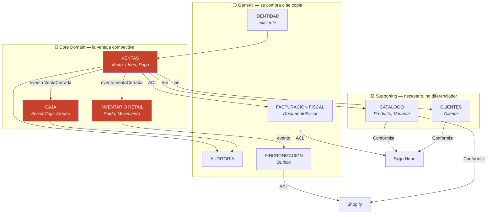
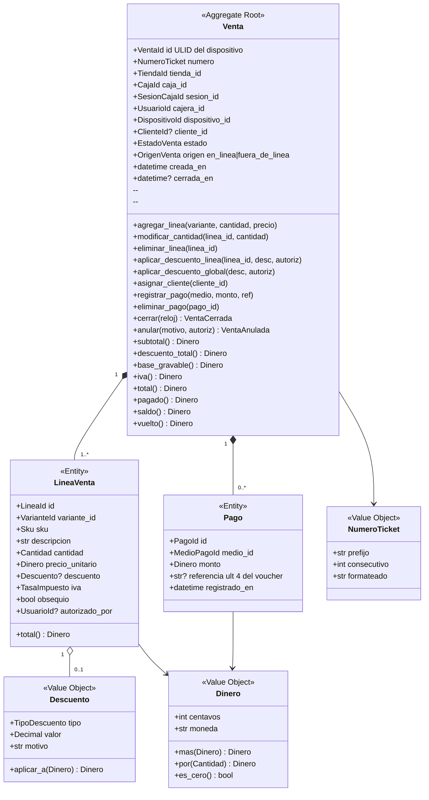
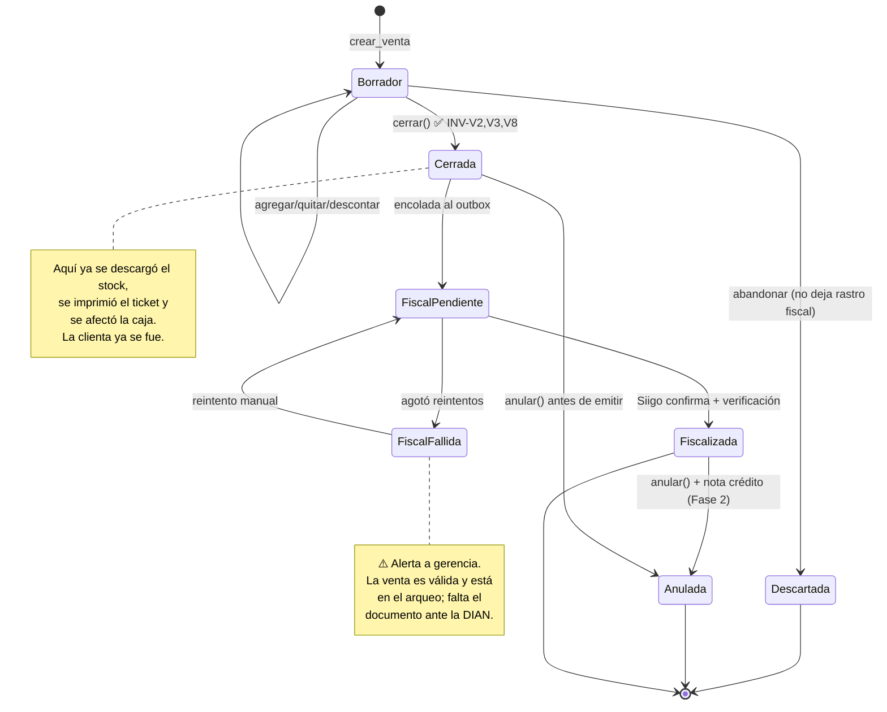
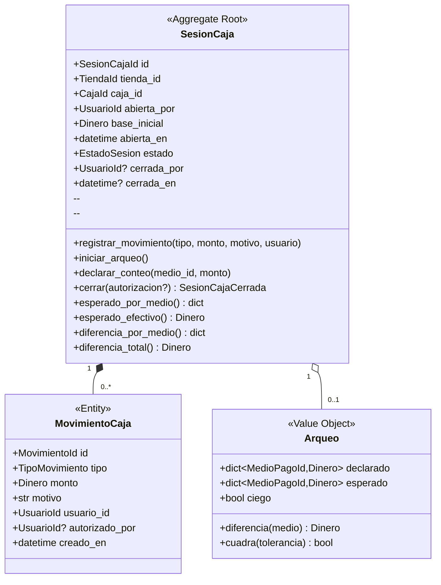
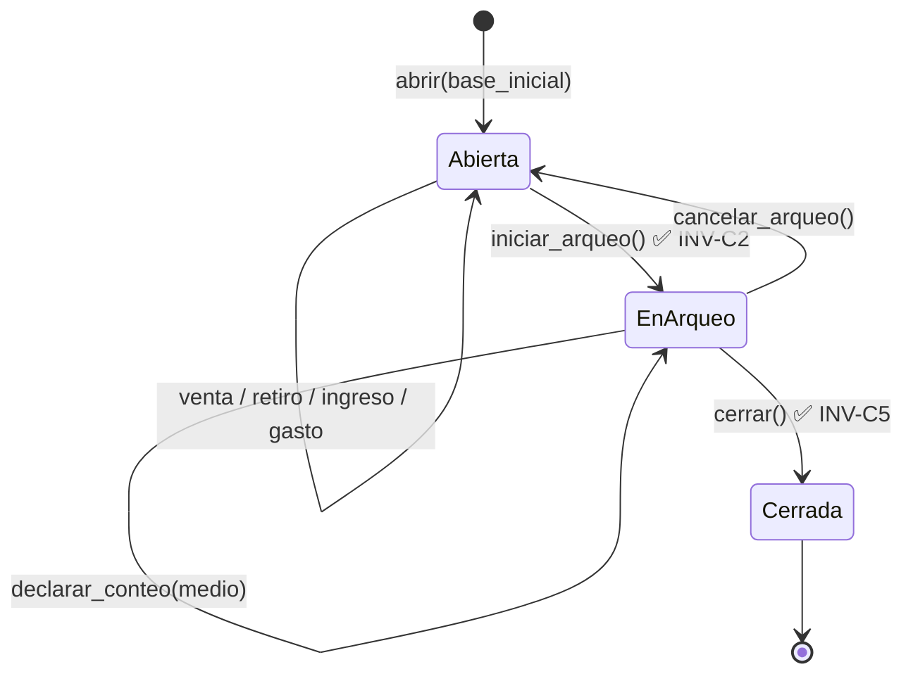
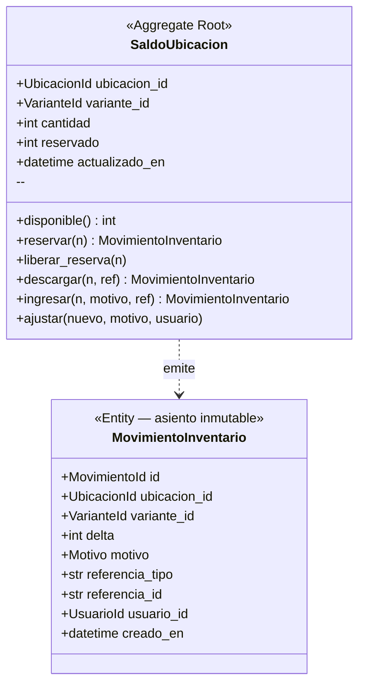
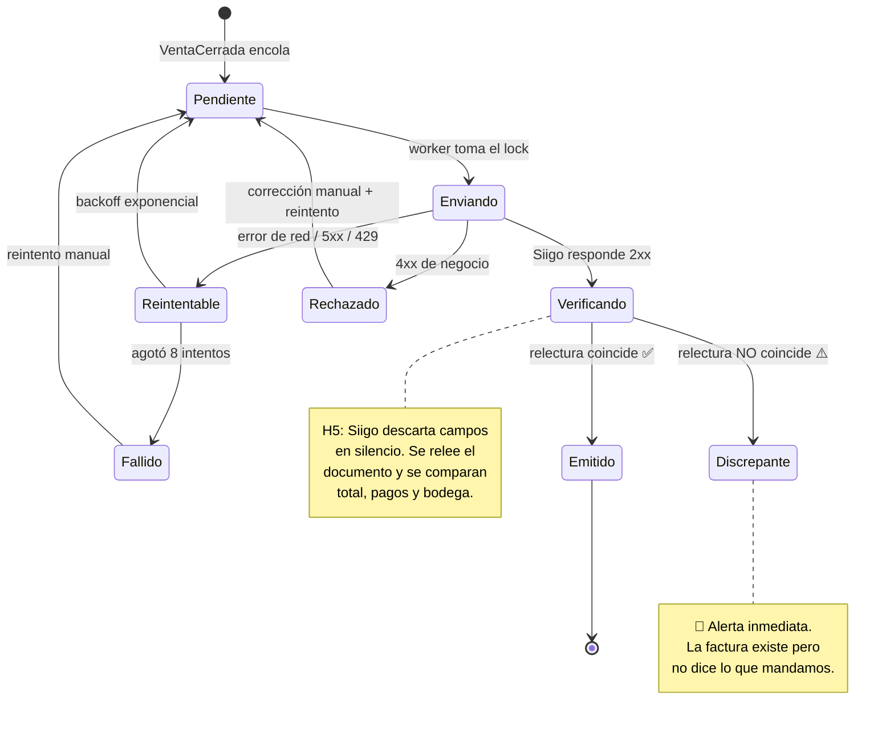

# 02 · Diseño de dominio (DDD)

---

## 1. Lenguaje ubicuo

El código se escribe con **estas** palabras. No "transaction", no "checkout", no "order".
Si la cajera lo llama turno, en el código se llama turno.

| Término | Significado exacto | Lo que **no** es |
|---|---|---|
| **Venta** | El hecho comercial completo: qué se llevó la clienta, cuánto pagó y cómo | No es la factura |
| **Documento fiscal** | La factura electrónica o el tiquete POS que representa la venta ante la DIAN | No es la venta |
| **Ticket** | El papel que se imprime y se entrega | No tiene valor fiscal por sí solo |
| **Turno** (`SesionCaja`) | El período entre que una cajera abre la caja y la cierra | No es el día |
| **Caja** | El punto de cobro físico. Florida tiene dos. | No es la tienda |
| **Tienda** | El local. Tiene una bodega de Siigo y un centro de costo. | No es la caja |
| **Ubicación** | Cualquier lugar donde hay stock: tienda, bodega central, Melonn | No es sólo la tienda |
| **Variante** | Lo que se vende: una talla concreta de una referencia. SKU `92611-1T10`. | No es la referencia |
| **Referencia** | El modelo con su variante de color (`92611-1`). Agrupa tallas. | No se vende directamente |
| **Referencia base** | El modelo sin color (`92611`). Agrupa colores. | — |
| **Arqueo** | El conteo físico del dinero al cerrar el turno | No es el cierre |
| **Base** | El efectivo con el que empieza el turno | No es venta |
| **Descuadre** | Diferencia entre lo contado y lo esperado | — |
| **Asiento** | Un movimiento del libro mayor de inventario | No es un ajuste |
| **Consumidor final** | Venta sin cliente identificado | No es "cliente genérico" |

---

## 2. Bounded contexts y mapa de contextos



### Relaciones entre contextos

| Origen → Destino | Patrón | Por qué |
|---|---|---|
| Ventas → Inventario | **Customer/Supplier** (evento) | Ventas manda; Inventario reacciona. Se comunican por `VentaCerrada`, no por llamadas directas. |
| Ventas → Caja | **Customer/Supplier** (evento) | El arqueo se calcula de los pagos, no al revés. |
| Ventas → Fiscal | **Anti-Corruption Layer** | El vocabulario de Siigo (`document_id`, `cost_center`, `payments[].id`) **no entra** al dominio. El mapeador traduce en el borde. |
| Catálogo ← Siigo/Shopify | **Conformist** | No negociamos su modelo. Nos adaptamos y normalizamos al entrar. |
| Clientes ← Siigo | **Conformist + ACL** | El cliente vive en Siigo por obligación fiscal. Guardamos `siigo_customer_id` y nuestro propio registro. |

**El ACL fiscal es la pieza que más va a rendir.** Todo lo que aprendimos a la mala sobre
Siigo —ids de pantalla que no son ids de API (H4), campos descartados en silencio (H5),
prefijos no emitibles (H1)— queda encapsulado en `infrastructure/siigo/`. El dominio de la
venta no sabe que Siigo existe.

---

## 3. Agregado `Venta` — raíz del core



### Invariantes de `Venta`

Estas son las reglas que el agregado **garantiza**. Ninguna vive en un endpoint, en el
frontend ni en un trigger de base de datos.

| # | Invariante | Por qué existe |
|---|---|---|
| **INV-V1** | Una venta **cerrada es inmutable**. Ningún método de mutación funciona después de `cerrar()`. | Un documento fiscal se emitió sobre ese contenido. Corregir = documento nuevo. |
| **INV-V2** | No se cierra sin al menos una línea con cantidad > 0 | Venta vacía no es venta |
| **INV-V3** | `suma(pagos) ≥ total`, y el excedente **sólo** puede provenir de efectivo (es el vuelto) | Cerrar con menos plata de la debida es un faltante garantizado |
| **INV-V4** | `total ≥ 0` | — |
| **INV-V5** | Todos los `Dinero` de la venta comparten moneda | Sin esto, sumar es mentir |
| **INV-V6** | Un descuento que supere el tope del rol de quien lo aplica **exige** `autorizado_por` de un usuario con el permiso, y queda registrado en la línea | Es el control anti-fraude más rentable de un POS |
| **INV-V7** | `precio_unitario > 0` salvo línea marcada `obsequio`, que **siempre** exige autorización | Un precio en cero es la forma clásica de sacar mercancía |
| **INV-V8** | La venta pertenece a una `SesionCaja` **abierta** de **esa** caja | No hay venta sin turno. Es lo que hace que el arqueo cuadre. |
| **INV-V9** | `cantidad > 0` en toda línea; una línea que llega a 0 se elimina | Evita líneas fantasma |
| **INV-V10** | `(caja_id, numero)` es único, y `venta_id` es único global | Idempotencia offline (ADR-005) |
| **INV-V11** | Anular exige motivo no vacío + autorización, y **sólo** aplica a ventas cerradas del turno en curso | Anular ventas de ayer es reescribir la historia contable |
| **INV-V12** | El IVA se calcula **por línea** y se suma; nunca sobre el total | Distintas líneas pueden tener distinta tarifa; calcular sobre el total introduce error de redondeo |

> **Dónde se hace cumplir cada una.** Diez de las doce viven dentro del agregado y se prueban
> sin base de datos. Las otras dos no pueden: **INV-V8** (la venta pertenece a un turno
> abierto) necesita cargar la `SesionCaja`, así que la verifica el caso de uso; **INV-V10**
> (idempotencia) es un índice único en la base — una regla que se comprueba en Python tiene
> una ventana de carrera, el índice no. Ambas están anotadas en el docstring de `venta.py`
> para que nadie las busque donde no están.

### Máquina de estados de `Venta`



**El punto de no retorno es `Cerrada`, no `Fiscalizada`.** Es la decisión más importante del
diseño (ADR-002) y lo que hace posible la promesa de 30 segundos.

---

## 4. Agregado `SesionCaja`



**Tipos de movimiento:** `base_inicial` · `venta` (automático) · `retiro` (sangría) ·
`ingreso` (aporte) · `gasto` (caja menor) · `ajuste`.

### Invariantes de `SesionCaja`

| # | Invariante | Por qué |
|---|---|---|
| **INV-C1** | Sólo puede existir **una** sesión `Abierta` por caja. Se garantiza con índice único parcial en BD, no con un `if`. | Dos turnos abiertos = arqueo imposible |
| **INV-C2** | No se cierra con ventas en `Borrador` de esa caja | Un carrito abierto es plata sin registrar |
| **INV-C3** | No se cierra con ventas de esa sesión en estado `FiscalPendiente` sin **reconocerlo explícitamente** | La cajera debe saber que hay documentos en cola |
| **INV-C4** | En **cierre ciego** (por defecto), `esperado_*` no se expone hasta que se declara el conteo completo | Anti-cuadre: si la cajera ve el esperado, escribe el esperado |
| **INV-C5** | Diferencia > umbral configurable exige justificación escrita + autorización de supervisor | Un faltante sin explicación no se puede cerrar solo |
| **INV-C6** | Un `retiro` no puede dejar el efectivo esperado en negativo | No se puede sacar plata que no hay |
| **INV-C7** | Una sesión cerrada es inmutable | — |
| **INV-C8** | Una venta offline que llega **después** del cierre de su sesión no se adjunta: se marca `sesion_desfasada` y se reporta al supervisor | Es el caso que rompe todos los POS mal diseñados. Modelarlo explícitamente es la diferencia. |



---

## 5. Agregado `SaldoUbicacion` + libro mayor

El inventario es el único contexto que se modela como **libro contable**, no como campo
mutable. La razón: `stock = stock - 1` no se puede auditar; una suma de asientos sí.



**Motivos:** `venta` · `anulacion` · `ingreso_compra` · `ajuste_conteo` · `traslado_salida` ·
`traslado_entrada` (Fase 2) · `devolucion` (Fase 2) · `merma`.

### Invariantes de inventario

| # | Invariante | Por qué |
|---|---|---|
| **INV-I1** | `disponible = cantidad - reservado ≥ 0` en operación **en línea** | No prometer lo que no hay |
| **INV-I2** | En **offline**, se permite negativo y se **alerta**. La prenda física ya se entregó. | ADR-005. Bloquear la venta con la prenda en la mano es peor que un negativo. |
| **INV-I3** | Todo movimiento tiene `referencia_tipo` + `referencia_id` trazables | Un asiento sin origen no se puede auditar |
| **INV-I4** | `cantidad` siempre debe ser igual a `SUM(delta)` del libro mayor | Job diario de verificación. Si no cuadra, el saldo materializado está corrupto. |
| **INV-I5** | Un movimiento es **inmutable**. Corregir = movimiento contrario. | Es un libro mayor, no una tabla |
| **INV-I6** | La reserva expira: un carrito abandonado libera su reserva a los 15 min | Sin esto, el stock se evapora en carritos muertos |

**Reserva atómica** (esto es lo que evita la sobreventa, y es una sola sentencia):

```sql
UPDATE retail.stock_ubicacion
   SET reservado = reservado + :n, actualizado_en = now()
 WHERE ubicacion_id = :u AND variante_id = :v
   AND (cantidad - reservado) >= :n
RETURNING cantidad - reservado AS disponible;
-- 0 filas ⇒ no hay stock. Sin race condition, sin SELECT previo.
```

---

## 6. Agregado `DocumentoFiscal`

Aísla toda la fealdad de Siigo. La `Venta` no sabe qué es un `document_id`.



| Campo | Contenido |
|---|---|
| `tipo` | `factura_electronica` · `pos_electronico` · `nota_credito` (Fase 2) |
| `proveedor` | `siigo` (el puerto admite otros) |
| `numero` | Ej. `FV-11-1334` |
| `cufe` | Código único de la DIAN |
| `pdf_url`, `xml_url` | Guardados, no sólo enlazados |
| `payload_snapshot` | Exactamente lo que se envió (para diagnosticar) |
| `respuesta_cruda` | Exactamente lo que devolvió |
| `intentos`, `ultimo_error` | Para el tablero de operación |

### Invariantes fiscales

| # | Invariante |
|---|---|
| **INV-F1** | Una venta tiene **como máximo un** documento fiscal en estado `Emitido`. Índice único parcial. |
| **INV-F2** | La emisión se hace bajo lock por `venta_id`. Nunca dos workers emiten la misma. |
| **INV-F3** | Un documento `Emitido` es inmutable. |
| **INV-F4** | Emitido ⇒ **siempre** verificado por relectura (H5). Sin relectura no se marca emitido. |
| **INV-F5** | El payload se congela al cerrar la venta. Si el catálogo cambia de precio mañana, el documento no cambia. |

---

## 7. Agregados de soporte

### `Variante` (Catálogo — read model)

```
Variante
  id · sku (VO) · referencia · color · talla · nombre
  precio_base: Dinero          ← sin IVA, normalizado al entrar (postventa_inventario.py:36)
  tasa_iva: TasaImpuesto
  codigo_barras: str           ← Code128, el que ya imprime Producción
  siigo_code: str
  shopify_variant_id: str
  activa: bool
  actualizado_en: datetime     ← llave de la sincronización incremental
```

**INV-CAT1** — `precio_base` se guarda **siempre sin IVA**. Siigo declara en `tax_included`
si su valor lo lleva; normalizar al revés parte o duplica el precio y nada avisa. Ya pasó.

**VO `Sku`** — parsea `92611-1T10` → `referencia=92611-1`, `talla=10`.

⚠️ **El `-1` es parte de la referencia, no de la talla.** La talla es el número final. Así lo
hace `siigo._parse_ref_talla`, que ya alimenta el inventario por bodega y el análisis de venta
por colección; si el POS parseara distinto, la misma prenda tendría dos identidades dentro del
mismo sistema y ningún informe cuadraría. Hay una **prueba de contrato** entre los dos que
falla si alguno cambia sin el otro.

El VO expone además `referencia_base` (`92611`) para agrupar colores en la rejilla del POS, y
`orden_talla()` para que las tallas se ordenen 4, 6, 8, 10, 12 y no 10, 12, 4, 6.

### `Cliente`

```
Cliente
  id · documento: DocumentoIdentidad (VO) · nombre · apellido
  telefono · correo · ciudad · direccion
  siigo_customer_id: str?      ← se crea perezosamente al primer documento fiscal
  creado_en · actualizado_en
```

**VO `DocumentoIdentidad`** — tipo (`CC`, `NIT`, `CE`, `PP`) + número, con **validación del
dígito de verificación del NIT** (algoritmo DIAN). Un NIT con DV malo hace que Siigo rechace
la factura con la clienta enfrente.

**INV-CLI1** — `(tipo_documento, numero)` único.
**INV-CLI2** — Una venta a **consumidor final** no lleva cliente. No se inventa un cliente
genérico: es un `cliente_id` nulo y punto. (Modelar la ausencia con un registro falso es la
raíz de las estadísticas de cliente corrompidas.)

---

## 8. Eventos de dominio

Los eventos son el pegamento entre contextos. Se publican al confirmar la transacción, nunca
antes.

| Evento | Lo emite | Reaccionan |
|---|---|---|
| `VentaCerrada` | Venta | Inventario (descarga) · Caja (suma al esperado) · Fiscal (encola) · Shopify (encola) · Auditoría · WebSocket |
| `VentaAnulada` | Venta | Inventario (reingresa) · Caja (resta) · Fiscal (nota crédito, Fase 2) · Auditoría |
| `DescuentoAutorizado` | Venta | Auditoría (⚠️ prioritario) · Tablero de supervisor |
| `LineaObsequiada` | Venta | Auditoría (⚠️ prioritario) |
| `SesionCajaAbierta` | Caja | Auditoría · WebSocket |
| `SesionCajaCerrada` | Caja | Auditoría · Informe a gerencia · Alerta si hay descuadre |
| `DescuadreDetectado` | Caja | Alerta a supervisor · Auditoría |
| `StockDescargado` | Inventario | Shopify (publica) · WebSocket (otras cajas) |
| `StockNegativoDetectado` | Inventario | Alerta operativa |
| `DocumentoFiscalEmitido` | Fiscal | Venta (adjunta número + CUFE) · Reimpresión · WhatsApp/correo al cliente |
| `DocumentoFiscalFallido` | Fiscal | 🚨 Alerta a gerencia |
| `DocumentoFiscalDiscrepante` | Fiscal | 🚨 Alerta crítica |
| `VentaOfflineSincronizada` | Sync | Auditoría · Tablero |
| `SesionDesfasadaDetectada` | Sync | Supervisor (INV-C8) |

### Estructura común

```
EventoDominio
  evento_id: ULID
  tipo: str
  ocurrido_en: datetime          ← hora del SERVIDOR, no del dispositivo
  agregado_tipo · agregado_id
  tienda_id · usuario_id
  version: int                   ← versionado del esquema del evento
  payload: dict
```

**Por qué `version`:** el día que `VentaCerrada` necesite un campo nuevo, los eventos viejos
del outbox tienen que seguir siendo procesables. Un evento sin versión es una migración
imposible dentro de dos años.

---

## 9. Servicios de dominio

Lógica que no pertenece a un solo agregado:

| Servicio | Responsabilidad |
|---|---|
| `CalculadoraImpuestos` | IVA por línea según tarifa de la variante; regla de redondeo unificada. Punto único de verdad para los días sin IVA. |
| `PoliticaDescuento` | Dado rol + tipo + monto → ¿permitido, requiere autorización, o prohibido? |
| `AsignadorConsecutivo` | Entrega el siguiente `NumeroTicket` desde el bloque arrendado de la caja |
| `ConciliadorInventario` | Compara libro mayor vs. Siigo y produce diferencias explicadas |
| `ValidadorCierre` | Reúne todas las condiciones que impiden cerrar un turno y las devuelve **juntas** (no una por una: la cajera tiene que ver todo lo que le falta de una vez) |

---

## 10. Lo que hace que esto NO sea CRUD con nombres bonitos

Prueba concreta. Estas cinco reglas viven en `domain/` y se prueban sin base de datos, sin
red y sin FastAPI:

1. Una venta con dos líneas al 19 % y una exenta calcula el IVA por línea (INV-V12).
2. Un descuento del 30 % aplicado por una cajera con tope 10 % **no se aplica**: lanza
   `RequiereAutorizacion`, y con el token de un supervisor sí se aplica y queda firmado (INV-V6).
3. Cerrar una venta con `pagado < total` lanza `PagoIncompleto` (INV-V3).
4. Una `SesionCaja` con una venta en `Borrador` no se puede poner en arqueo (INV-C2).
5. Reservar 3 unidades cuando hay 2 disponibles devuelve 0 filas y **no** deja el saldo en
   negativo (INV-I1).

Si mañana alguien mueve el POS a otra base de datos, esos cinco tests siguen pasando sin
tocar una línea. Eso es el valor entero de la arquitectura.
