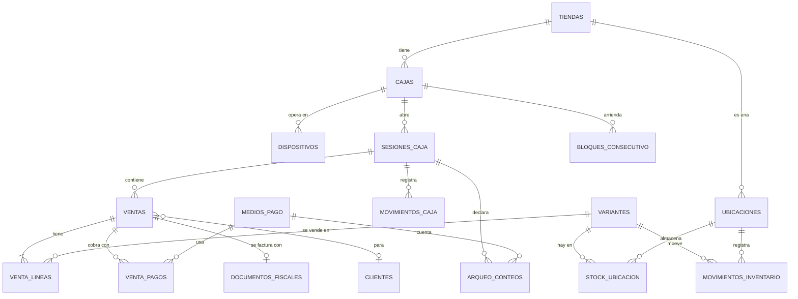

# 04 · Modelo de datos (PostgreSQL)

Todo vive en el schema `retail`, aislado del resto del ERP. Migraciones con Alembic
(ADR-004), reversibles y verificadas en CI.

---

## 1. Diagrama entidad-relación



---

## 2. DDL

> **Orden de creación.** El DDL de abajo está agrupado por tema para poder leerlo, no en
> orden de dependencias. Al pasarlo a migraciones de Alembic el orden real es:
> `tiendas → cajas → ubicaciones → medios_pago → dispositivos → clientes → variantes →
> bloques_consecutivo → sesiones_caja → ventas → venta_lineas → venta_pagos →
> stock_ubicacion → movimientos_inventario → documentos_fiscales → outbox → auditoría`.
> `ventas` referencia `clientes`, y `venta_lineas` referencia `variantes`.

### Preparación

```sql
CREATE SCHEMA IF NOT EXISTS retail;
CREATE EXTENSION IF NOT EXISTS pg_trgm;    -- búsqueda por similitud
CREATE EXTENSION IF NOT EXISTS unaccent;   -- "café" ≡ "cafe"
CREATE EXTENSION IF NOT EXISTS btree_gin;

-- Función inmutable para poder indexar texto normalizado
CREATE OR REPLACE FUNCTION retail.norm(t text) RETURNS text
  LANGUAGE sql IMMUTABLE PARALLEL SAFE AS
$$ SELECT lower(unaccent(coalesce(t, ''))) $$;

-- Dominio de dinero: SIEMPRE entero en centavos (ADR-008). Nunca numeric, nunca float.
CREATE DOMAIN retail.centavos AS bigint;

-- ULID de 26 caracteres, generado en el dispositivo
CREATE DOMAIN retail.ulid AS char(26)
  CHECK (VALUE ~ '^[0-9A-HJKMNP-TV-Z]{26}$');
```

### Estructura física

```sql
CREATE TABLE retail.tiendas (
    id                  text PRIMARY KEY,              -- 'florida', 'arrayanes'
    nombre              text NOT NULL,
    activa              boolean NOT NULL DEFAULT true,
    -- Configuración Siigo. Ids REALES de la API, nunca los de pantalla (H4).
    siigo_bodega_id     integer,                       -- 48 Florida · 37 Arrayanes
    siigo_centro_costo_id integer,                     -- 774 Florida · 677 Arrayanes
    -- Política operativa, configurable sin deploy
    permite_stock_negativo boolean NOT NULL DEFAULT true,
    cierre_ciego        boolean NOT NULL DEFAULT true,
    umbral_descuadre    retail.centavos NOT NULL DEFAULT 500000,   -- $5.000
    zona_horaria        text NOT NULL DEFAULT 'America/Bogota',
    creada_en           timestamptz NOT NULL DEFAULT now()
);

CREATE TABLE retail.cajas (
    id                  text PRIMARY KEY,              -- 'florida_caja1'
    tienda_id           text NOT NULL REFERENCES retail.tiendas(id),
    nombre              text NOT NULL,                 -- 'Florida · Caja 1'
    -- Facturación. NULL mientras no esté confirmado por API: el sistema se niega
    -- a facturar con un id adivinado (precedente: tiendas.py:83-86).
    prefijo_factura     text,                          -- 'FV-11'
    siigo_documento_id  integer,                       -- 31433
    tipo_documento_fiscal text NOT NULL DEFAULT 'factura_electronica'
        CHECK (tipo_documento_fiscal IN ('factura_electronica','pos_electronico')),
    activa              boolean NOT NULL DEFAULT true,
    creada_en           timestamptz NOT NULL DEFAULT now()
);

CREATE TABLE retail.dispositivos (
    id                  retail.ulid PRIMARY KEY,
    caja_id             text NOT NULL REFERENCES retail.cajas(id),
    nombre              text NOT NULL,                 -- 'Tablet mostrador Florida'
    token_hash          text NOT NULL,                 -- bcrypt del token de dispositivo
    activo              boolean NOT NULL DEFAULT true,
    registrado_por      text NOT NULL,
    registrado_en       timestamptz NOT NULL DEFAULT now(),
    ultimo_visto_en     timestamptz,
    ultimo_desfase_ms   integer,                       -- reloj del dispositivo vs servidor (R7)
    version_app         text,
    revocado_en         timestamptz,
    revocado_por        text
);

-- Una ubicación es cualquier sitio con stock: tienda, bodega central, Melonn.
-- Diseñada así para que los traslados (Fase 2) no requieran modelo nuevo.
CREATE TABLE retail.ubicaciones (
    id                  text PRIMARY KEY,              -- 'tienda:florida', 'bodega:central'
    tipo                text NOT NULL CHECK (tipo IN ('tienda','bodega','transito','externa')),
    nombre              text NOT NULL,
    tienda_id           text REFERENCES retail.tiendas(id),
    siigo_bodega_id     integer,
    activa              boolean NOT NULL DEFAULT true
);

CREATE TABLE retail.medios_pago (
    id                  text PRIMARY KEY,              -- 'efectivo', 'datafono_florida'
    nombre              text NOT NULL,
    tipo                text NOT NULL
        CHECK (tipo IN ('efectivo','tarjeta','transferencia','credito','otro')),
    tienda_id           text REFERENCES retail.tiendas(id),  -- NULL = todas
    siigo_forma_pago_id integer NOT NULL,              -- 12244, 12243, 8987, 8282
    entra_al_arqueo     boolean NOT NULL DEFAULT true,
    exige_referencia    boolean NOT NULL DEFAULT false, -- últimos 4 del voucher
    permite_vuelto      boolean NOT NULL DEFAULT false, -- sólo efectivo
    orden               integer NOT NULL DEFAULT 0,
    activo              boolean NOT NULL DEFAULT true
);
```

> `medios_pago` es una **tabla**, no un enum. Por eso un bono, un anticipo o una pasarela
> nueva entran en Fase 2 sin migración de esquema.

### Consecutivos (lo que hace posible el offline)

```sql
CREATE TABLE retail.bloques_consecutivo (
    id                  bigserial PRIMARY KEY,
    caja_id             text NOT NULL REFERENCES retail.cajas(id),
    prefijo             text NOT NULL,
    desde               bigint NOT NULL,
    hasta               bigint NOT NULL,
    siguiente           bigint NOT NULL,
    arrendado_en        timestamptz NOT NULL DEFAULT now(),
    arrendado_a         retail.ulid REFERENCES retail.dispositivos(id),
    agotado             boolean NOT NULL DEFAULT false,
    CHECK (desde <= siguiente AND siguiente <= hasta + 1)
);

-- Un solo bloque vigente por caja
CREATE UNIQUE INDEX ux_bloque_vigente
    ON retail.bloques_consecutivo (caja_id) WHERE NOT agotado;
```

**Cómo funciona.** Al abrir turno, la caja arrienda un bloque de 500 números. El dispositivo
numera localmente dentro de su bloque, así que **sin internet sigue emitiendo tickets con
numeración válida y sin colisión con la otra caja**. Al 80 % consumido pide el siguiente.

Un bloque agotado sin usar deja huecos en la numeración interna: es intencional y no tiene
efecto fiscal, porque el consecutivo DIAN lo asigna Siigo al emitir.

### Caja

```sql
CREATE TABLE retail.sesiones_caja (
    id                  retail.ulid PRIMARY KEY,
    tienda_id           text NOT NULL REFERENCES retail.tiendas(id),
    caja_id             text NOT NULL REFERENCES retail.cajas(id),
    numero_turno        bigint NOT NULL,
    estado              text NOT NULL DEFAULT 'abierta'
        CHECK (estado IN ('abierta','en_arqueo','cerrada')),
    base_inicial        retail.centavos NOT NULL CHECK (base_inicial >= 0),
    abierta_por         text NOT NULL,
    abierta_en          timestamptz NOT NULL DEFAULT now(),
    cerrada_por         text,
    cerrada_en          timestamptz,
    diferencia_total    retail.centavos,
    justificacion       text,
    autorizada_por      text,
    dispositivo_id      retail.ulid REFERENCES retail.dispositivos(id),
    CHECK (estado <> 'cerrada' OR cerrada_en IS NOT NULL)
);

-- INV-C1: una sola sesión abierta por caja. Garantizado por la BASE, no por un if.
CREATE UNIQUE INDEX ux_sesion_abierta
    ON retail.sesiones_caja (caja_id) WHERE estado <> 'cerrada';

CREATE TABLE retail.movimientos_caja (
    id                  retail.ulid PRIMARY KEY,
    sesion_id           retail.ulid NOT NULL REFERENCES retail.sesiones_caja(id),
    tipo                text NOT NULL
        CHECK (tipo IN ('base_inicial','venta','retiro','ingreso','gasto','ajuste')),
    medio_pago_id       text REFERENCES retail.medios_pago(id),
    monto               retail.centavos NOT NULL,      -- con signo
    motivo              text NOT NULL DEFAULT '',
    venta_id            retail.ulid,
    usuario_id          text NOT NULL,
    autorizado_por      text,
    creado_en           timestamptz NOT NULL DEFAULT now(),
    CHECK (tipo NOT IN ('retiro','gasto') OR motivo <> '')
);
CREATE INDEX ix_mov_caja_sesion ON retail.movimientos_caja (sesion_id, creado_en);

CREATE TABLE retail.arqueo_conteos (
    sesion_id           retail.ulid NOT NULL REFERENCES retail.sesiones_caja(id),
    medio_pago_id       text NOT NULL REFERENCES retail.medios_pago(id),
    declarado           retail.centavos NOT NULL,
    esperado            retail.centavos NOT NULL,      -- congelado al declarar
    declarado_por       text NOT NULL,
    declarado_en        timestamptz NOT NULL DEFAULT now(),
    PRIMARY KEY (sesion_id, medio_pago_id)
);
```

> `esperado` se **congela** en el momento de declarar. Si se recalculara al leer, una venta
> offline que entra después cambiaría el arqueo de un turno ya cerrado, y la diferencia
> firmada por la cajera dejaría de ser reproducible.

### Ventas

```sql
CREATE TABLE retail.ventas (
    id                  retail.ulid PRIMARY KEY,       -- ⭐ generado en el DISPOSITIVO
    numero              text NOT NULL,                 -- 'FV-11-1334'
    prefijo             text NOT NULL,
    consecutivo         bigint NOT NULL,
    tienda_id           text NOT NULL REFERENCES retail.tiendas(id),
    caja_id             text NOT NULL REFERENCES retail.cajas(id),
    sesion_id           retail.ulid NOT NULL REFERENCES retail.sesiones_caja(id),
    dispositivo_id      retail.ulid REFERENCES retail.dispositivos(id),
    cajera_id           text NOT NULL,
    cliente_id          retail.ulid REFERENCES retail.clientes(id),  -- NULL = consumidor final
    estado              text NOT NULL DEFAULT 'borrador'
        CHECK (estado IN ('borrador','cerrada','anulada','descartada')),
    estado_fiscal       text NOT NULL DEFAULT 'no_aplica'
        CHECK (estado_fiscal IN ('no_aplica','pendiente','enviando','emitido',
                                 'rechazado','fallido','discrepante')),
    origen              text NOT NULL DEFAULT 'en_linea'
        CHECK (origen IN ('en_linea','fuera_de_linea')),
    -- Totales congelados al cerrar. Se recalculan de las líneas, pero se
    -- persisten: un informe no puede depender de recalcular 200.000 líneas.
    subtotal            retail.centavos NOT NULL DEFAULT 0,
    descuento_total     retail.centavos NOT NULL DEFAULT 0,
    base_gravable       retail.centavos NOT NULL DEFAULT 0,
    iva_total           retail.centavos NOT NULL DEFAULT 0,
    total               retail.centavos NOT NULL DEFAULT 0,
    pagado              retail.centavos NOT NULL DEFAULT 0,
    vuelto              retail.centavos NOT NULL DEFAULT 0,
    moneda              char(3) NOT NULL DEFAULT 'COP',
    creada_en           timestamptz NOT NULL DEFAULT now(),
    creada_en_dispositivo timestamptz,                 -- informativa (R7)
    cerrada_en          timestamptz,
    sincronizada_en     timestamptz,
    sesion_desfasada    boolean NOT NULL DEFAULT false, -- INV-C8
    anulada_en          timestamptz,
    anulada_por         text,
    motivo_anulacion    text,
    documento_origen_id retail.ulid,                   -- reservado: cambios (Fase 2)

    CHECK (total >= 0),
    CHECK (estado <> 'cerrada' OR cerrada_en IS NOT NULL),
    CHECK (estado <> 'cerrada' OR pagado >= total),     -- INV-V3 en la base
    CHECK (estado <> 'anulada' OR motivo_anulacion IS NOT NULL)
);

-- INV-V10: idempotencia y unicidad del ticket
CREATE UNIQUE INDEX ux_venta_numero ON retail.ventas (caja_id, prefijo, consecutivo);

CREATE INDEX ix_ventas_sesion   ON retail.ventas (sesion_id) WHERE estado = 'cerrada';
CREATE INDEX ix_ventas_tienda   ON retail.ventas (tienda_id, cerrada_en DESC);
CREATE INDEX ix_ventas_cliente  ON retail.ventas (cliente_id, cerrada_en DESC)
    WHERE cliente_id IS NOT NULL;
CREATE INDEX ix_ventas_fiscal   ON retail.ventas (estado_fiscal)
    WHERE estado_fiscal IN ('pendiente','enviando','rechazado','fallido','discrepante');

CREATE TABLE retail.venta_lineas (
    id                  retail.ulid PRIMARY KEY,
    venta_id            retail.ulid NOT NULL REFERENCES retail.ventas(id) ON DELETE CASCADE,
    orden               integer NOT NULL,
    variante_id         retail.ulid NOT NULL REFERENCES retail.variantes(id),
    -- Datos CONGELADOS: si el catálogo cambia mañana, esta línea no cambia (INV-F5)
    sku                 text NOT NULL,
    descripcion         text NOT NULL,
    cantidad            integer NOT NULL CHECK (cantidad > 0),      -- INV-V9
    precio_unitario     retail.centavos NOT NULL CHECK (precio_unitario >= 0),
    descuento_tipo      text CHECK (descuento_tipo IN ('porcentaje','valor')),
    descuento_valor     numeric(10,4),
    descuento_monto     retail.centavos NOT NULL DEFAULT 0,
    descuento_motivo    text,
    autorizado_por      text,
    obsequio            boolean NOT NULL DEFAULT false,
    tasa_iva            numeric(5,2) NOT NULL DEFAULT 19.00,
    base_gravable       retail.centavos NOT NULL DEFAULT 0,
    iva_monto           retail.centavos NOT NULL DEFAULT 0,
    total_linea         retail.centavos NOT NULL DEFAULT 0,
    creada_en           timestamptz NOT NULL DEFAULT now(),

    -- INV-V7: precio 0 sólo si es obsequio autorizado
    CHECK (precio_unitario > 0 OR (obsequio AND autorizado_por IS NOT NULL)),
    -- INV-V6: descuento con motivo
    CHECK (descuento_monto = 0 OR descuento_motivo IS NOT NULL)
);
CREATE UNIQUE INDEX ux_linea_orden ON retail.venta_lineas (venta_id, orden);
CREATE INDEX ix_linea_variante ON retail.venta_lineas (variante_id);

CREATE TABLE retail.venta_pagos (
    id                  retail.ulid PRIMARY KEY,
    venta_id            retail.ulid NOT NULL REFERENCES retail.ventas(id) ON DELETE CASCADE,
    medio_pago_id       text NOT NULL REFERENCES retail.medios_pago(id),
    monto               retail.centavos NOT NULL CHECK (monto > 0),
    referencia          text,                          -- últimos 4 del voucher
    registrado_en       timestamptz NOT NULL DEFAULT now()
);
CREATE INDEX ix_pagos_venta ON retail.venta_pagos (venta_id);
CREATE INDEX ix_pagos_medio ON retail.venta_pagos (medio_pago_id, registrado_en);
```

### Clientes

```sql
CREATE TABLE retail.clientes (
    id                  retail.ulid PRIMARY KEY,
    tipo_documento      text NOT NULL DEFAULT 'CC'
        CHECK (tipo_documento IN ('CC','NIT','CE','PP','TI')),
    numero_documento    text NOT NULL,
    dv                  char(1),                       -- dígito de verificación del NIT
    nombre              text NOT NULL,
    apellido            text NOT NULL DEFAULT '',
    telefono            text,
    correo              text,
    ciudad              text,
    direccion           text,
    siigo_customer_id   text,                          -- perezoso: al primer documento
    notas               text,
    creado_por          text,
    creado_en           timestamptz NOT NULL DEFAULT now(),
    actualizado_en      timestamptz NOT NULL DEFAULT now()
);
CREATE UNIQUE INDEX ux_cliente_doc ON retail.clientes (tipo_documento, numero_documento);
CREATE INDEX ix_cliente_busqueda ON retail.clientes
    USING gin ((retail.norm(nombre || ' ' || apellido || ' ' || numero_documento
                || ' ' || coalesce(telefono,''))) gin_trgm_ops);
```

### Catálogo

```sql
CREATE TABLE retail.variantes (
    id                  retail.ulid PRIMARY KEY,
    sku                 text NOT NULL,                 -- '93634-1T12'
    referencia          text NOT NULL,                 -- '93634'
    talla               text NOT NULL,                 -- '1T12'
    color               text NOT NULL DEFAULT '',
    nombre              text NOT NULL,
    codigo_barras       text,                          -- Code128 que ya imprime Producción
    precio_base         retail.centavos NOT NULL,      -- ⚠️ SIEMPRE SIN IVA (INV-CAT1)
    tasa_iva            numeric(5,2) NOT NULL DEFAULT 19.00,
    siigo_code          text,
    shopify_variant_id  text,
    imagen_url          text,
    activa              boolean NOT NULL DEFAULT true,
    actualizado_en      timestamptz NOT NULL DEFAULT now()  -- llave del delta
);
CREATE UNIQUE INDEX ux_variante_sku ON retail.variantes (sku);
CREATE UNIQUE INDEX ux_variante_barras ON retail.variantes (codigo_barras)
    WHERE codigo_barras IS NOT NULL;
CREATE INDEX ix_variante_delta ON retail.variantes (actualizado_en);

-- Read model del buscador (CQRS lado Q). Se alimenta por eventos.
CREATE TABLE retail.catalogo_busqueda (
    variante_id         retail.ulid PRIMARY KEY REFERENCES retail.variantes(id),
    texto_busqueda      text NOT NULL,                 -- sku+ref+nombre+color+talla, normalizado
    referencia          text NOT NULL,
    talla               text NOT NULL,
    color               text NOT NULL,
    precio_base         retail.centavos NOT NULL,
    stock_por_tienda    jsonb NOT NULL DEFAULT '{}',   -- {"florida": 3, "arrayanes": 0}
    actualizado_en      timestamptz NOT NULL DEFAULT now()
);
CREATE INDEX ix_catalogo_trgm ON retail.catalogo_busqueda
    USING gin (texto_busqueda gin_trgm_ops);
```

### Inventario — libro mayor + saldo

```sql
-- El saldo materializado. Se puede reconstruir sumando el libro mayor (INV-I4).
CREATE TABLE retail.stock_ubicacion (
    ubicacion_id        text NOT NULL REFERENCES retail.ubicaciones(id),
    variante_id         retail.ulid NOT NULL REFERENCES retail.variantes(id),
    cantidad            integer NOT NULL DEFAULT 0,
    reservado           integer NOT NULL DEFAULT 0 CHECK (reservado >= 0),
    stock_minimo        integer NOT NULL DEFAULT 0,
    actualizado_en      timestamptz NOT NULL DEFAULT now(),
    PRIMARY KEY (ubicacion_id, variante_id)
);
CREATE INDEX ix_stock_bajo ON retail.stock_ubicacion (ubicacion_id)
    WHERE cantidad <= stock_minimo;

-- EL LIBRO MAYOR. Append-only. Sin UPDATE, sin DELETE.
CREATE TABLE retail.movimientos_inventario (
    id                  bigserial PRIMARY KEY,
    ubicacion_id        text NOT NULL REFERENCES retail.ubicaciones(id),
    variante_id         retail.ulid NOT NULL REFERENCES retail.variantes(id),
    delta               integer NOT NULL CHECK (delta <> 0),
    saldo_despues       integer NOT NULL,              -- para auditar sin recalcular todo
    motivo              text NOT NULL CHECK (motivo IN (
        'venta','anulacion','ingreso_compra','ajuste_conteo','merma',
        'traslado_salida','traslado_entrada','devolucion','sincronizacion_inicial')),
    referencia_tipo     text NOT NULL,                 -- 'venta','ajuste','conteo'
    referencia_id       text NOT NULL,                 -- INV-I3: nunca vacío
    usuario_id          text NOT NULL,
    creado_en           timestamptz NOT NULL DEFAULT now()
);
CREATE INDEX ix_mov_inv_variante ON retail.movimientos_inventario
    (ubicacion_id, variante_id, creado_en DESC);
CREATE INDEX ix_mov_inv_ref ON retail.movimientos_inventario (referencia_tipo, referencia_id);

REVOKE UPDATE, DELETE ON retail.movimientos_inventario FROM PUBLIC;
```

### Documentos fiscales

```sql
CREATE TABLE retail.documentos_fiscales (
    id                  retail.ulid PRIMARY KEY,
    venta_id            retail.ulid NOT NULL REFERENCES retail.ventas(id),
    tipo                text NOT NULL
        CHECK (tipo IN ('factura_electronica','pos_electronico','nota_credito')),
    proveedor           text NOT NULL DEFAULT 'siigo',
    estado              text NOT NULL DEFAULT 'pendiente'
        CHECK (estado IN ('pendiente','enviando','verificando','emitido',
                          'rechazado','fallido','discrepante')),
    numero              text,                          -- 'FV-11-1334'
    cufe                text,
    documento_externo_id text,                         -- id en Siigo
    pdf_url             text,
    xml_url             text,
    payload_snapshot    jsonb NOT NULL,                -- lo que se ENVIÓ
    respuesta_cruda     jsonb,                         -- lo que se RECIBIÓ
    verificacion        jsonb,                         -- resultado de la relectura (H5)
    intentos            integer NOT NULL DEFAULT 0,
    ultimo_error        text,
    proximo_intento_en  timestamptz,
    creado_en           timestamptz NOT NULL DEFAULT now(),
    emitido_en          timestamptz
);

-- INV-F1: máximo un documento emitido por venta
CREATE UNIQUE INDEX ux_doc_emitido ON retail.documentos_fiscales (venta_id)
    WHERE estado = 'emitido' AND tipo <> 'nota_credito';
CREATE INDEX ix_doc_cola ON retail.documentos_fiscales (proximo_intento_en)
    WHERE estado IN ('pendiente','rechazado');
```

### Outbox

```sql
CREATE TABLE retail.outbox (
    id                  bigserial PRIMARY KEY,
    tipo                text NOT NULL,   -- 'emitir_documento','publicar_stock_shopify',...
    agregado_tipo       text NOT NULL,
    agregado_id         text NOT NULL,
    payload             jsonb NOT NULL,
    estado              text NOT NULL DEFAULT 'pendiente'
        CHECK (estado IN ('pendiente','procesando','procesado','fallido')),
    intentos            integer NOT NULL DEFAULT 0,
    max_intentos        integer NOT NULL DEFAULT 8,
    proximo_intento_en  timestamptz NOT NULL DEFAULT now(),
    ultimo_error        text,
    creado_en           timestamptz NOT NULL DEFAULT now(),
    procesado_en        timestamptz
);
CREATE INDEX ix_outbox_cola ON retail.outbox (proximo_intento_en, id)
    WHERE estado = 'pendiente';
```

El worker toma trabajo con `FOR UPDATE SKIP LOCKED` — así varias réplicas nunca procesan el
mismo mensaje, aunque sólo se despliegue una:

```sql
UPDATE retail.outbox SET estado='procesando', intentos=intentos+1
 WHERE id IN (SELECT id FROM retail.outbox
               WHERE estado='pendiente' AND proximo_intento_en <= now()
               ORDER BY id LIMIT 20 FOR UPDATE SKIP LOCKED)
RETURNING *;
```

### Auditoría encadenada (ADR-010)

```sql
CREATE TABLE retail.auditoria (
    id                  bigserial,
    ocurrido_en         timestamptz NOT NULL DEFAULT now(),
    tienda_id           text,
    caja_id             text,
    sesion_id           retail.ulid,
    usuario_id          text,
    dispositivo_id      retail.ulid,
    evento              text NOT NULL,    -- 'venta.cerrada','descuento.autorizado',...
    severidad           text NOT NULL DEFAULT 'info'
        CHECK (severidad IN ('info','aviso','critico')),
    agregado_tipo       text,
    agregado_id         text,
    payload             jsonb NOT NULL DEFAULT '{}',
    ip                  inet,
    hash_anterior       text,
    hash                text NOT NULL,    -- sha256(hash_anterior || payload canónico)
    PRIMARY KEY (id, ocurrido_en)
) PARTITION BY RANGE (ocurrido_en);

CREATE TABLE retail.auditoria_2026_08 PARTITION OF retail.auditoria
    FOR VALUES FROM ('2026-08-01') TO ('2026-09-01');

CREATE INDEX ix_audit_evento  ON retail.auditoria (evento, ocurrido_en DESC);
CREATE INDEX ix_audit_usuario ON retail.auditoria (usuario_id, ocurrido_en DESC);
CREATE INDEX ix_audit_critico ON retail.auditoria (ocurrido_en DESC)
    WHERE severidad = 'critico';

REVOKE UPDATE, DELETE ON retail.auditoria FROM PUBLIC;
```

**Eventos con severidad `critico`** (los que alguien querría borrar): descuento por encima
del tope, obsequio, anulación de venta, cierre con descuadre, reimpresión de ticket, retiro
de caja, ajuste de inventario, revocación de dispositivo, cambio de permisos.

### Vista de lectura

```sql
CREATE MATERIALIZED VIEW retail.venta_resumen AS
SELECT v.id, v.numero, v.tienda_id, v.caja_id, v.sesion_id, v.cajera_id,
       v.cliente_id, c.nombre || ' ' || c.apellido AS cliente_nombre,
       c.numero_documento AS cliente_documento,
       v.total, v.descuento_total, v.iva_total, v.cerrada_en, v.estado_fiscal,
       (SELECT count(*) FROM retail.venta_lineas l WHERE l.venta_id = v.id) AS items,
       (SELECT sum(l.cantidad) FROM retail.venta_lineas l WHERE l.venta_id = v.id) AS unidades,
       (SELECT string_agg(DISTINCT m.nombre, ', ')
          FROM retail.venta_pagos p JOIN retail.medios_pago m ON m.id = p.medio_pago_id
         WHERE p.venta_id = v.id) AS medios_pago
  FROM retail.ventas v
  LEFT JOIN retail.clientes c ON c.id = v.cliente_id
 WHERE v.estado = 'cerrada';

CREATE UNIQUE INDEX ux_venta_resumen ON retail.venta_resumen (id);
-- REFRESH CONCURRENTLY cada 5 min. El turno en curso se lee de las tablas base.
```

---

## 3. Cambios fuera del schema `retail`

```sql
-- Permisos finos del POS sobre la tabla de usuarios existente
ALTER TABLE public.usuarios
    ADD COLUMN IF NOT EXISTS pin_hash            text,
    ADD COLUMN IF NOT EXISTS tiendas_asignadas   text[] DEFAULT '{}',
    ADD COLUMN IF NOT EXISTS tope_descuento_pct  numeric(5,2) DEFAULT 0,
    ADD COLUMN IF NOT EXISTS puede_autorizar_descuento boolean DEFAULT false,
    ADD COLUMN IF NOT EXISTS puede_anular_venta  boolean DEFAULT false,
    ADD COLUMN IF NOT EXISTS puede_cerrar_con_descuadre boolean DEFAULT false,
    ADD COLUMN IF NOT EXISTS pin_intentos_fallidos integer DEFAULT 0,
    ADD COLUMN IF NOT EXISTS pin_bloqueado_hasta timestamptz;
```

Sigue el patrón ya existente de `puede_autorizar_precosteo` / `puede_autorizar_corte`
(`usuarios.py:83`).

---

## 4. Decisiones de modelado y su razón

| Decisión | Razón |
|---|---|
| Dinero en `bigint` de centavos | ADR-008. Precedente real: 169.900 → 67.960. |
| ULID generado en el cliente como PK | Idempotencia offline sin coordinación (ADR-005) |
| Índices únicos **parciales** para las invariantes | `ux_sesion_abierta`, `ux_doc_emitido`: la regla la garantiza la base, no un `if` que se puede olvidar |
| Totales persistidos **y** derivables | Se recalculan al cerrar y se congelan. Un informe no puede recalcular 200.000 líneas. |
| Datos del producto copiados en la línea | El precio de hoy no puede cambiar la factura de ayer (INV-F5) |
| `esperado` congelado en el arqueo | Una venta offline tardía no puede alterar un cierre ya firmado |
| Auditoría particionada por mes | Crece indefinidamente; se archiva a 24 meses sin tocar el índice caliente |
| `ubicaciones` genérica, no "tiendas" | Traslados y bodega central (Fase 2) sin modelo nuevo |
| `medios_pago` como tabla | Bonos y pasarelas nuevas sin migración |
| `documento_origen_id` reservado | Los cambios (Fase 2) enlazan sin ALTER TABLE |

---

## 5. Estimación de volumen

Con 3 cajas, ~60 ventas/día/tienda, 3 ítems por venta:

| Tabla | Filas/año | Notas |
|---|---|---|
| `ventas` | ~65.000 | Trivial |
| `venta_lineas` | ~200.000 | Trivial |
| `movimientos_inventario` | ~250.000 | Crece con conteos y ajustes |
| `auditoria` | ~1.500.000 | Particionada; el motivo de particionar |
| `outbox` | ~150.000 | Se purga a los 30 días de procesado |

**A 30 tiendas:** ~2M ventas/año, ~15M filas de auditoría. Postgres lo maneja sin
inmutarse con estos índices y el particionado. No hay nada que rediseñar para llegar ahí.
