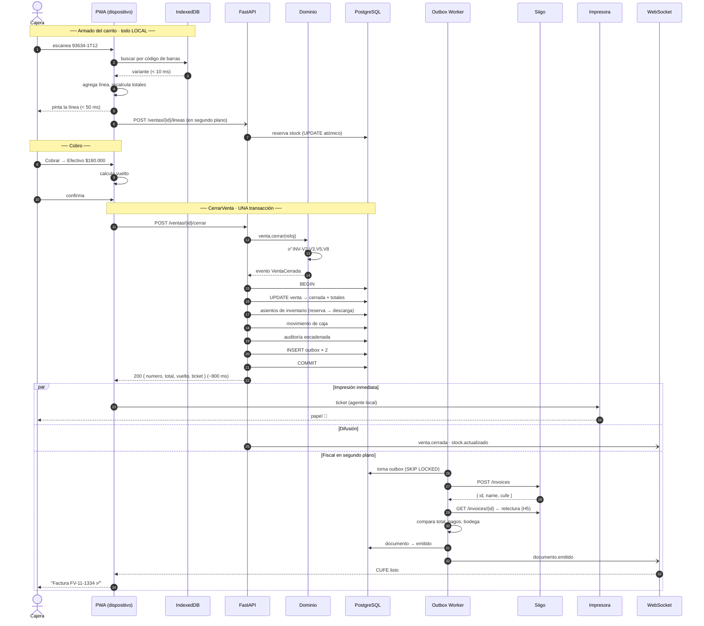
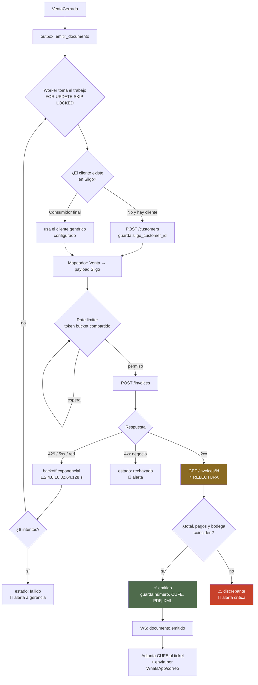
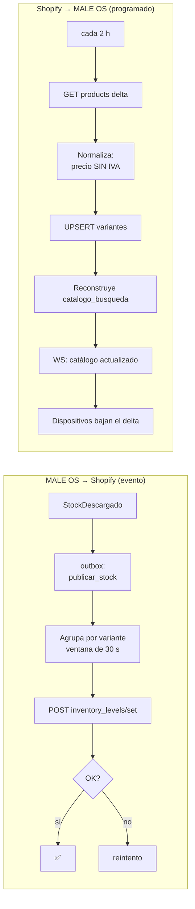
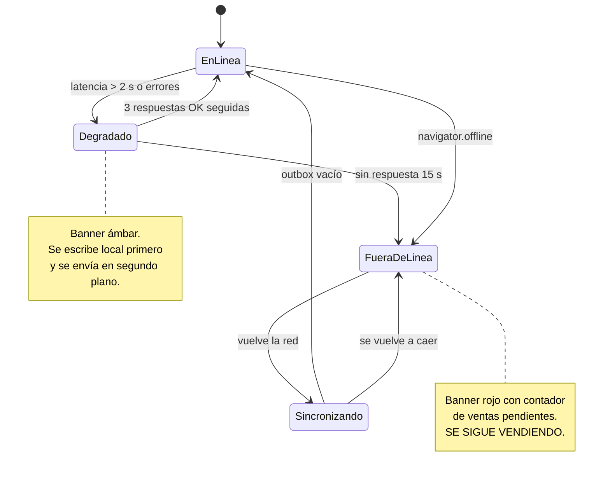
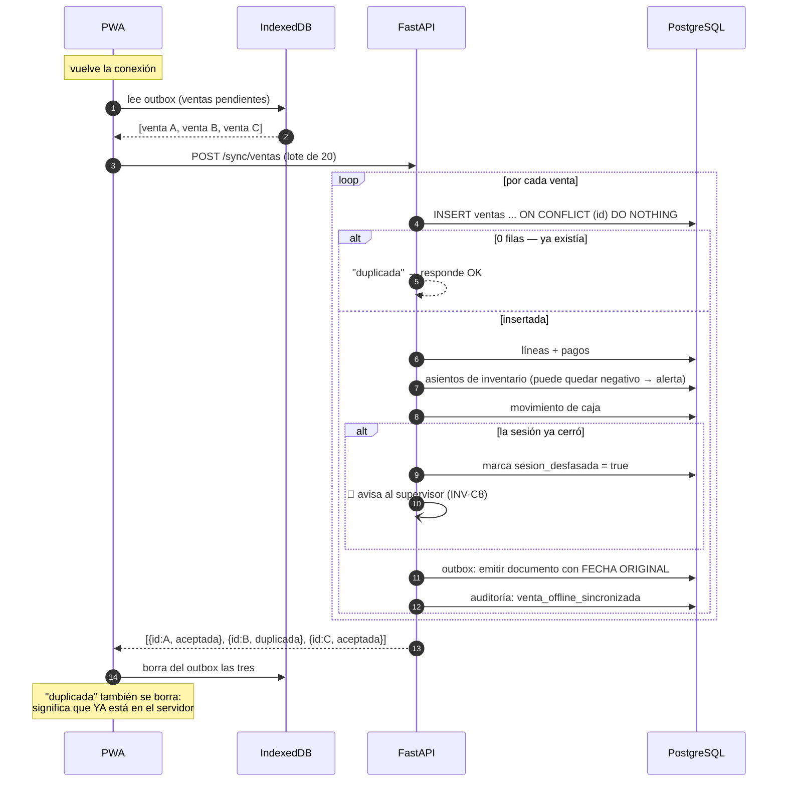
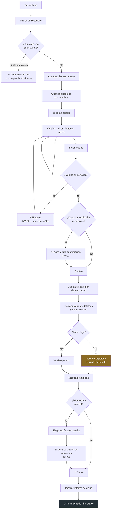
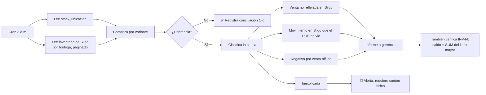

# 05 · Flujos

---

## 1. Flujo completo de una venta

### 1.1 Presupuesto de los 30 segundos

El objetivo no es "rápido". Es este reparto, medido en el dispositivo, percentil 95:

| Paso | Tiempo | Quién manda |
|---|---|---|
| Escanear 3 prendas (3 × 1,5 s) | 4,5 s | La cajera |
| Buscar/asignar cliente (opcional) | 4 s | La cajera |
| Clic en **Cobrar** | 0,2 s | Sistema |
| Elegir medio de pago y digitar monto | 6 s | La cajera |
| Cobro en el datáfono | 8 s | El banco |
| **`CerrarVenta` → ticket en la impresora** | **0,8 s** | **Sistema** |
| Entregar bolsa y ticket | 4 s | La cajera |
| **Total** | **~27,5 s** | |

**El sistema sólo controla 1 segundo de los 30.** Por eso ADR-002 (no esperar a Siigo) no es
una optimización: es la única forma de que el número cierre. Si `CerrarVenta` esperara a
Siigo, ese 0,8 s se volvería 2–6 s en un día bueno y 30 s en uno malo.

### 1.2 Secuencia



**Lo que la clienta ve:** la cajera escanea, cobra, y el papel sale. El resto ocurre después
de que se fue.

### 1.3 Qué pasa si algo falla en cada punto

| Falla | Consecuencia | Recuperación |
|---|---|---|
| No hay stock al agregar la línea | **Advertencia**, no bloqueo. La prenda está en la mano. | Se registra el negativo y se alerta |
| Se cae internet armando el carrito | El carrito ya vive en IndexedDB. Sigue igual. | Al volver, el outbox descarga |
| Se cae internet al cerrar | La venta se cierra **local**, entra al outbox, se imprime | Sincroniza al volver, sin duplicar (ULID) |
| Falla la impresora | La venta **ya está cerrada y es válida** | Botón de reimprimir (auditado) |
| Siigo devuelve 429 | El documento queda en cola | Reintento exponencial |
| Siigo devuelve 4xx de negocio | Estado `rechazado` + alerta | Corrección manual y reintento desde el panel |
| La relectura no coincide (H5) | Estado `discrepante` 🚨 | **Alerta crítica.** La factura existe pero no dice lo que mandamos. |
| Se cae Postgres al cerrar | La transacción no se confirma; la PWA reintenta | Idempotencia: la venta entra una sola vez |

---

## 2. Flujo fiscal con Siigo



### Por qué la relectura es obligatoria

`tiendas.py:211-221` lo documenta con precisión: *"mientras el campo iba mal formado, Siigo lo
descartaba en silencio y el error no aparecía nunca —el inventario simplemente no se movía"*.

Un POS que confía en el `200 OK` de Siigo va a producir facturas que no dicen lo que la
cajera cobró, y nadie se entera hasta el cierre contable del mes. La relectura cuesta una
petición más y convierte un error invisible en una alerta.

Ya existe el precedente exacto en el repo: `postventa_caja.comparar_pagos()`.

### Rate limiting

Siigo va a ~1 petición/segundo. Con 3 cajas facturando un sábado son ~3 documentos/minuto en
promedio, pero **con picos**: a las 6 p.m. entran 15 ventas en 10 minutos.

- Token bucket **compartido en Redis** (no por réplica).
- Prioridad: emisión fiscal > consulta de cliente > sincronización de catálogo.
- La sincronización de catálogo se pausa cuando hay cola fiscal.
- El tablero muestra la profundidad de la cola. Cola > 20 o antigüedad > 10 min ⇒ alerta.

### Creación perezosa del cliente en Siigo

El cliente se crea en **nuestra** base al instante (funciona offline) y en Siigo sólo al
emitir su primer documento. Razones: no ensucia Siigo con clientes que nunca compraron, no
bloquea la venta si Siigo está caído, y no gasta cuota de la API en la ruta crítica.

---

## 3. Flujo de sincronización con Shopify

Dos direcciones, ninguna en la ruta crítica de la venta.



### Decisiones

| Decisión | Razón |
|---|---|
| **Agrupación de 30 s** antes de publicar stock | Vender 3 prendas de la misma referencia genera 1 llamada, no 3 |
| Shopify es fuente de verdad del **catálogo** (nombre, foto, precio de lista) | Ahí lo edita el equipo comercial |
| MALE OS es fuente de verdad del **stock de tienda** (ADR-003) | Ahí es donde nace el movimiento |
| Se publica sólo el stock de las **ubicaciones mapeadas** | La bodega de Melonn la maneja logística, no el POS |
| Delta incremental por `updated_at` | El catálogo completo son 80 páginas a 1 req/s |
| Se pagina **explícitamente** y se reporta si quedó incompleto | H10 + precedente: una medición truncada se lee como prueba y es falsa |

### El riesgo del token de Shopify

Memoria del proyecto: después de enero 2026 no hay `shpat_` nuevos; el token se obtiene por
`client_credentials` y **dura 24 h**. El adaptador tiene que renovarlo solo y alertar si no
puede — un token vencido a las 3 a.m. no puede descubrirse a las 10 a.m. con la tienda
abierta.

---

## 4. Flujo offline y sincronización

### 4.1 Estados de conexión



### 4.2 Qué funciona sin internet

| Función | Offline | Cómo |
|---|:---:|---|
| Buscar producto | ✅ | Catálogo completo en IndexedDB |
| Ver stock | ⚠️ | Último snapshot, con marca de antigüedad visible |
| Agregar/quitar/modificar líneas | ✅ | Todo local |
| Descuento dentro del tope de la cajera | ✅ | La política se evalúa local |
| Descuento que exige autorización | ❌ | Requiere validar el PIN del supervisor contra el servidor |
| Buscar cliente existente | ✅ | Los clientes de la tienda se replican |
| Crear cliente | ✅ | Se crea local, se sincroniza después |
| Cobrar con cualquier medio | ✅ | — |
| Cerrar venta | ✅ | Consecutivo del bloque arrendado |
| Imprimir ticket | ✅ | Agente local por IP, en la red de la tienda |
| Documento fiscal | ⏳ | Encolado; se emite al volver |
| Stock de **otras** tiendas | ❌ | Requiere red |
| Abrir turno | ⚠️ | Sólo si ya hay bloque de consecutivos arrendado |
| Cerrar turno | ⚠️ | Se puede declarar el conteo; el cierre formal exige sincronizar primero |

### 4.3 Sincronización



**La garantía:** ejecutar el mismo lote 100 veces produce exactamente el mismo estado que
ejecutarlo una vez. Es lo que permite reintentar sin miedo.

### 4.4 Límites deliberados del modo offline

| Límite | Valor | Por qué |
|---|---|---|
| Máximo tiempo offline antes de advertir | 4 h | Después, el riesgo de descuadre e inconsistencia crece rápido |
| Máximo tiempo offline antes de bloquear ventas nuevas | 24 h (configurable) | Un dispositivo desconectado una semana no debería seguir emitiendo |
| Descuentos que exigen autorización | Bloqueados offline | No se puede validar el PIN del supervisor |
| Ventas offline sin sincronizar antes de cerrar turno | 0 | El arqueo tiene que ser sobre datos completos |

---

## 5. Flujo de caja (turno completo)



### El cierre ciego

Por defecto la cajera **no ve** cuánto debería haber hasta que declara lo que contó. Es la
única forma de que el arqueo mida algo: si ve el esperado, escribe el esperado, y el
descuadre desaparece de los informes sin desaparecer de la realidad.

Configurable por tienda (`tiendas.cierre_ciego`) porque hay operaciones donde estorba, pero
el valor por defecto es `true`.

### Contenido del informe de cierre

```
MALE'DENIM · Florida · Caja 1
Turno #1284 · Cajera: María R.
Abierto  2026-08-05 09:02      Cerrado  2026-08-05 20:15

Base inicial                                    $  200.000
Ventas: 47 tickets · 89 unidades              $ 8.940.000
  Efectivo                                     $ 2.310.000
  Datáfono Florida                             $ 6.630.000
Retiros (2)                                    -$ 1.500.000
Gastos (1)                                     -$    35.000

ESPERADO EN CAJA (efectivo)                    $   975.000
CONTADO                                        $   960.000
DIFERENCIA                                     -$    15.000  ⚠️
  Justificación: faltante de vuelto, turno tarde
  Autorizó: Laura M. (Supervisora)

Datáfono esperado    $ 6.630.000
Datáfono declarado   $ 6.630.000    ✅

Descuentos aplicados: 6 · $312.000
  De los cuales autorizados por supervisor: 2 · $180.000
Anulaciones: 1 (ticket FV-11-1301)
Documentos fiscales pendientes: 0 ✅
Ventas offline sincronizadas: 3
```

---

## 6. Flujo de conciliación de inventario (diario, 3 a.m.)



Y verifica la cadena de hashes de auditoría (ADR-010). Si un eslabón no cuadra, alguien tocó
la tabla por fuera de la aplicación: alerta crítica inmediata.
