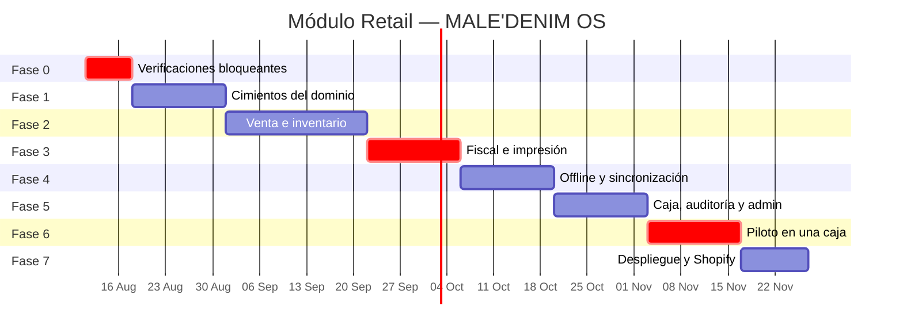

# 08 · Roadmap de desarrollo

Siete fases. Cada una tiene **criterio de salida verificable**: no se avanza a la siguiente
hasta que la anterior esté demostrada, no hasta que "esté lista".

> ## ⚠️ Orden vigente (decidido 2026-08-05): la facturación va de último
>
> **1 → 2 → 4 → 5 → 3 → 6 → 7.** La Fase 3 (fiscal) se corre al final, justo antes del
> piloto.
>
> **Por qué se puede.** El emisor fiscal está detrás de un puerto (ADR-001) y la venta se
> cierra sin esperar a Siigo (ADR-002). El dominio, la pantalla de venta, el inventario, el
> modo offline y la caja **no saben que Siigo existe**. Nada de eso se bloquea.
>
> **Lo que hay que tener presente.** El POS no puede abrir en una tienda sin facturación:
> "de último" significa *lo último antes de salir a producción*, no opcional. Y mover el
> riesgo mayor al final invierte el consejo habitual de atacar primero lo desconocido — lo
> que lo hace aceptable aquí es que la incógnita ya no es técnica sino administrativa, y se
> resuelve en paralelo sin ocupar tiempo de desarrollo.
>
> **La única precaución:** hacer el diagnóstico de la Fase 0 en algún momento antes de llegar
> a la Fase 3 (son cuatro clics en Swagger y no cuesta nada). Si `automatic_number` viene en
> `false`, son ~2 días más en la Fase 3, y es mejor saberlo con semanas de anticipación que
> la semana que toca.

Estimación en semanas de un desarrollador dedicado. Con dos personas, las fases 2 y 3 se
solapan parcialmente (backend / frontend).

---

## Fase 0 · Verificaciones bloqueantes — 1 semana

**Sin esto, todo lo demás puede ser trabajo perdido.** No se escribe código de negocio.

| Tarea | Entregable |
|---|---|
| **Crear los comprobantes nuevos por tienda** (D1 ✅ decidida) | Runbook completo en [09-HABILITACION-FISCAL.md](09-HABILITACION-FISCAL.md): rango DIAN → comprobante en Siigo → **aparece en `GET /document-types`** → factura de prueba releída → ids en `retail.cajas` |
| *(opcional, alto valor)* Activar FV-5 «Cambios» (id 27154) | Arregla hoy el paliativo de postventa con una sola variable: `SIIGO_DOC_FACTURA_CAMBIO=27154`. Sin deploy. |
| Medir la velocidad real de Siigo | Informe: peticiones/segundo sostenidas, latencia p50/p95, comportamiento del 429 |
| Confirmar D2 — sólo si la convivencia va a durar más allá del piloto | Decisión escrita. Con prefijos nuevos, convivir durante el piloto ya no cuesta nada. |
| Confirmar D3 (datáfono) | Decisión escrita |
| **Medir cuánto tarda hoy una venta en Siigo POS** | Cronómetro, 20 ventas reales. Es la línea base contra la que se mide el éxito (R16). |
| Inventario de hardware por tienda | Equipos, lectores, impresoras, red, UPS |
| Descubrir por API todos los ids de Siigo | Bodegas, centros de costo, formas de pago, tipos de documento — **ninguno de pantalla** (H4) |

**Criterio de salida:** el prefijo nuevo aparece en `GET /document-types` **y** existe una
factura emitida por API con él, verificada por relectura. El primer punto es el que hay que
comprobar primero: es gratis y responde solo si el resto tiene sentido.

---

## Fase 1 · Cimientos del dominio — 2 semanas

Se construye el corazón. Sin base de datos, sin HTTP, sin Siigo.

| Tarea | Detalle |
|---|---|
| Esqueleto del módulo | `backend/modules/retail/` con las cuatro capas |
| Value objects | `Dinero`, `Cantidad`, `Sku`, `NumeroTicket`, `Descuento`, `DocumentoIdentidad` (con DV del NIT) |
| Agregado `Venta` | Todas las invariantes INV-V1..V12 |
| Agregado `SesionCaja` | INV-C1..C8 |
| Agregado `SaldoUbicacion` | INV-I1..I6 |
| Servicios de dominio | `CalculadoraImpuestos`, `PoliticaDescuento`, `ValidadorCierre` |
| Eventos de dominio | Con versionado de esquema |
| Migraciones Alembic | Todo el DDL del documento 04 |
| Repositorios + UnitOfWork | SQLAlchemy 2.0 async |
| Guardas de CI | Test de imports del dominio, lint anti-`float`, migraciones reversibles |

**Criterio de salida**
- Cobertura del dominio ≥ 90 %.
- Los 5 tests del documento 02 §10 pasan **sin base de datos y sin red**, en menos de 1 s.
- `alembic upgrade head && alembic downgrade base` limpio.
- Un test mata la conexión a mitad de una transacción y verifica que no quedó nada escrito (R3).

---

## Fase 2 · Venta e inventario — 3 semanas

| Backend | Frontend |
|---|---|
| Comandos: crear venta, líneas, descuentos, pagos, cerrar | Layout del POS (`/pos`), tema oscuro |
| Reserva atómica de stock + libro mayor | **Pantalla de venta (P3)** completa |
| Read model `catalogo_busqueda` con trigram | Buscador con foco permanente + detección de escáner |
| Consultas: buscar producto, stock multitienda | Rejilla de productos con foto |
| Comandos de cliente + validación de DV | Carrito con cantidades y descuentos |
| Permisos `retail` + topes de descuento | **Pantalla de cobro (P4)** con pago mixto |
| Sincronización de catálogo desde Siigo/Shopify | Diálogos de descuento (P6) y autorización (P7) |
| WebSocket hub + Redis pub/sub | Pantallas de cliente (P8, P9) |

**Criterio de salida**
- Venta completa de 3 ítems, cliente asignado, pago mixto, en **≤ 30 s cronometrados** por
  alguien que no escribió el código.
- Búsqueda ≤ 50 ms con el catálogo completo cargado.
- `CerrarVenta` ≤ 800 ms p95.
- Prueba de sobreventa: dos dispositivos, última unidad, exactamente uno gana (R5).
- `next build` en verde (no basta `tsc --noEmit`).

---

## Fase 3 · Fiscal e impresión — 2 semanas

La fase que convierte una venta en un documento.

| Tarea |
|---|
| Outbox: tabla, despachador, worker como servicio Railway independiente |
| Adaptador Siigo: mapeador `Venta → payload`, envolviendo el `EmisorSiigo` existente |
| **Verificador por relectura** (H5) — sin esto no se marca emitido |
| Rate limiter con token bucket compartido en Redis |
| Máquina de estados del documento fiscal + reintentos con backoff |
| Creación perezosa del cliente en Siigo |
| Guardado de PDF y XML |
| Adaptador de impresión sobre el agente local existente + plantilla ESC/POS |
| Pantalla de venta cerrada (P5) con el CUFE llegando por WebSocket |
| Envío del documento por WhatsApp / correo |
| Panel de cola fiscal + reintento manual |

**Criterio de salida**
- 100 ventas emitidas contra el ambiente de pruebas de Siigo, **100 verificadas por
  relectura**, 0 discrepancias.
- Prueba de tres workers concurrentes: exactamente un documento por venta (R4).
- 100 tickets impresos con el backend caído (R9).
- Simulacro de 200 ventas en 30 min: ningún documento espera más de 5 min (R2).

---

## Fase 4 · Offline y sincronización — 2 semanas

| Tarea |
|---|
| Service worker + manifiesto PWA, instalable |
| IndexedDB: catálogo, clientes, outbox, turno, carrito |
| Índice de búsqueda local + sincronización incremental por delta |
| Cola outbox con reintento exponencial |
| Arriendo de bloques de consecutivos |
| `SincronizarVentaOffline` con idempotencia |
| Manejo de sesión desfasada (INV-C8) |
| Registro de desfase de reloj (R7) |
| Indicador de conexión (P14) y máquina de estados de conectividad |
| Límites del modo offline (4 h advertencia, 24 h bloqueo) |

**Criterio de salida**
- **2 horas de operación real en modo avión**, 20 ventas, 0 pérdidas.
- El mismo lote enviado 100 veces produce 50 ventas, no 5.000 (R6).
- Venta con el reloj corrido 3 h: queda con hora de servidor y genera alerta (R7).
- Corte de energía a mitad de venta: el carrito se recupera (R11).

---

## Fase 5 · Caja, auditoría y administración — 2 semanas

| Tarea |
|---|
| Apertura de turno con conteo por denominación (P2) |
| Movimientos de caja: retiro, ingreso, gasto |
| Arqueo con **cierre ciego** (P12) |
| Informe de cierre impreso |
| Auditoría encadenada con hash + verificador diario |
| Pantalla de auditoría (P15) |
| Tablero de supervisor en tiempo real (P13) |
| Ventas del turno (P11) + reimpresión auditada + anulación |
| Administración: tiendas, cajas, dispositivos, medios de pago, topes |
| Registro y revocación de dispositivos |
| Job de conciliación de inventario contra Siigo |
| Alertas a Slack/WhatsApp reutilizando `slack_notifier` |

**Criterio de salida**
- Turno completo abierto y cerrado con diferencia justificada y autorizada.
- La cadena de auditoría detecta una modificación hecha a mano en la base.
- La conciliación de inventario reporta las diferencias **clasificadas por causa**.

---

## Fase 6 · Piloto — 2 semanas

**Una caja. Una tienda. En paralelo con el sistema actual si D2 fue "convivencia".**

| Semana | Actividad |
|---|---|
| 1 | Capacitación (2 h por cajera) · operación acompañada · registro de toda fricción |
| 2 | Operación sola · métricas diarias · correcciones de fricción |

**Métricas que se miden todos los días**

| Métrica | Objetivo |
|---|---|
| Tiempo por venta (p95) | ≤ 30 s **y menor que la línea base de Fase 0** |
| Ventas perdidas | 0 |
| Documentos fiscales fallidos | < 1 % |
| Descuadre no explicado | $0 |
| Diferencia de inventario vs. Siigo | < 0,5 % |
| Fricción reportada por la cajera | Tendencia a la baja |

**Criterio de salida:** dos semanas seguidas cumpliendo las seis. Si el tiempo por venta no
baja de la línea base, **no se despliega**: se rediseña la pantalla de venta. Un POS más lento
que el anterior no se adopta, por bueno que sea por dentro (R16).

---

## Fase 7 · Despliegue y Shopify — 1,5 semanas

| Tarea |
|---|
| Publicación de stock a Shopify desde el POS (con agrupación de 30 s) |
| Renovación automática del token de Shopify + alerta (R15) |
| Despliegue a las tres cajas |
| Retiro de Siigo POS (si D2 = reemplazo) |
| **Retiro de `postventa_caja`** — deja de tener sentido |
| Documentación de operación para las cajeras |
| Runbook: qué hacer cuando falla Siigo, la impresora, la red |
| Tablero de salud del módulo |

**Criterio de salida:** una semana de las tres cajas operando sin incidentes de severidad
alta, y el runbook probado provocando cada falla a propósito.

---

## Resumen

| Fase | Semanas | Acumulado |
|---|---|---|
| 0 · Verificaciones | 1 | 1 |
| 1 · Dominio | 2 | 3 |
| 2 · Venta e inventario | 3 | 6 |
| 3 · Fiscal e impresión | 2 | 8 |
| 4 · Offline | 2 | 10 |
| 5 · Caja y auditoría | 2 | 12 |
| 6 · Piloto | 2 | 14 |
| 7 · Despliegue | 1,5 | **15,5** |

**~16 semanas con un desarrollador. ~11 con dos** (las fases 2, 3 y 5 se paralelizan por
backend/frontend; 0, 4 y 6 no se comprimen).

### Qué se puede recortar si hace falta llegar antes

| Recorte | Ahorro | Costo |
|---|---|---|
| Tablero de supervisor en tiempo real | 4 días | Gerencia consulta el informe del día |
| Conteo por denominación en apertura/arqueo | 2 días | Se digita el total |
| Envío del documento por WhatsApp | 3 días | Se entrega el ticket impreso |
| Auditoría encadenada (hash) | 3 días | Auditoría normal, sin detección de alteración |
| Consulta de stock multitienda | 3 días | Se pierden ventas que se podían salvar |

**Lo que NO se puede recortar, en ningún caso:** offline (Fase 4), verificación por relectura
fiscal (Fase 3), reserva atómica de stock (Fase 2) y el piloto (Fase 6). Cada uno de esos
existe para evitar una pérdida de dinero concreta y demostrable.

---

## Después: Fase 2 del producto

Lo que este diseño deja preparado y **no** se construye ahora: cambios, devoluciones, notas
crédito, bonos, fidelización, apartados, traslados entre tiendas, integración con el datáfono,
comisiones de asesoras, promociones automáticas (2×1, combos), múltiples marcas por instalación.

Ninguno requiere rediseñar el modelo de dominio. Están contemplados en las decisiones de
modelado del documento 04 §4.
